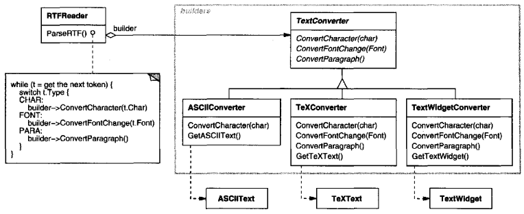
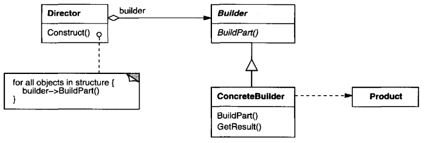
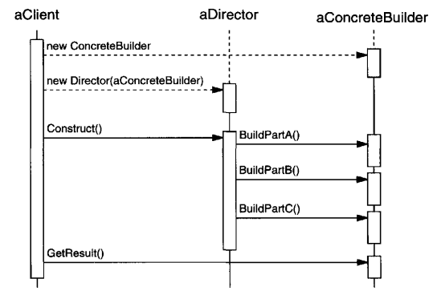

# Builder

## Intent
Separate the construction of a complex object from its representation so that the same construction process can create different representations.

## Motivation
A reader for the RTF (Rich Text Format) document exchange format should be able to convert RTF to many text formats. The reader might convert RTF documents into plain ASCII text or into a text widget that can be edited interactively. The problem, however, is that the number of possible conversions is open-ended. So it should be easy to add a new conversion without modifying the reader.

A solution is to configure the RTFReader class with a TextConverter object that converts RTF to another textual representation. As the RTFReader parses the RTF document, it uses the TextConverter to perform the conversion. Whenever the RTFReader recognizes an RTF token (either plain text or an RTF control word), it issues a request to the TextConverter to convert the token. TextConverter objects are responsible both for performing the data conversion and for representing the token in a particular format.

Subclasses of TextConverter specialize in different conversions and formats. For example, an ASCIIConverter ignores requests to convert anything except plain text. A TeXConverter, on the other hand, will implement operations for all requests in order to produce a TeX representation that captures all the stylistic information in the text. A TextWidgetConverter will produce a complex user interface object that lets the user see and edit the text.

Each kind of converter class takes the mechanism for creating and assembling a complex object and puts it behind an abstract interface. The converter is separate from the reader, which is responsible for parsing an RTF document.

The Builder pattern captures all these relationships. Each converter class is called a **builder** in the pattern, and the reader is called the **director**. Applied to this example, the Builder pattern separates the algorithm for interpreting a textual format (that is, the parser for RTF documents) from how a converted format gets created and represented. This lets us reuse the RTFReader's parsing algorithm to create different text representations from RTF documents - just configure the RTFReader with different subclasses of TextConverter.

## Applicability
Use the Builder pattern when

- the algorithm for creating a complex object should be independent of the parts that make up the object and how they're assembled.
- the construction process must allow different representations for the object that's constructed.

## Structure

## Participants

- **Builder** (TextConverter)
    - specifies an abstract interface for creating parts of a Product object.
- **ConcreteBuilder** (ASCIIConverter, TeXConverter, TextWidgetConverter)
    - constructs and assembles parts of the product by implementing the Builder interface.
    -defines and keeps track of the representation it creates.
    provides an interface for retrieving the product (e.g., GetASCIIText, GetTextWidget).
- **Director** (RTFReader)
    - constructs an object using the Builder interface.
- **Product** (ASCIIText, TeXText, TextWidget)
    - represents the complex objects under construction. ConcreteBuilder builds the product's internal representation and defines the process by which it's assembled.
    - includes classes that define the constituent parts, including interfaces for assembling the parts into the final result.

## Collaborations
- The client creates the Director object and configures it with the desired Builder object.
- Director notifies the builder whenever a part of the product should be built.
- Builder handles requests from the director and adds parts to the product.
- The client retrieves the product from the builder.

The following interaction diagram illustrates how Builder and Director cooperate with a client.

## Consequences
Here are key consequences of the Builder pattern:

1. **It lets you vary a product's internal representation.** The Builder object provides the director with an abstract interface for constructing the product. The interface lets the builder hide the representation and internal structure of the product. It also hides how the product gets assembled. Because the product is constructed through an abstract interface, all you have to do to change the product's internal representation is define a new kind of builder.
2. **It isolates code for construction and representation.** The Builder pattern improves modularity by encapsulating the way a complex object is constructed and represented. Clients needn't know anything about the classes that define the product's internal structure; such classes don't appear in Builder's interface. Each concreteBuilder contains all the code to create and assemble a particular kind of product. The code is written once; then different Directors can reuse it to build Product variants from the same set of parts. In the earlier RTF example, we could define a reader for a format other than RTF, say, an SGMLReader, and use the same TextConverters to generate ASCIIText, TeXText, and TextWidget renditions of SGML documents.
3. **It gives you finer control over the construction process.** Unlike creational patterns that construct products in one shot, the Builder pattern constructs the products step by step under the director's control. Only when the product is finished does the director retrieve it from the builder. Hence the Builder interface reflects the process of constructing the product more than other creational patterns. This gives you finer control over the construction process and consequently the internal structure of the resulting product.

## Implementation
Typically there's an abstract BUilder class that defines an operation for each component that a director may ask it to create. The operations do nothing by default. A ConcreteBuilder class overrides operations for components it's interested in creating.
Here are other implementation issues to consider:
1. **Assembly and construction interface.** Builders construct their products in step-by-step fashion. Therefore the Builder class interface must be general enough to allow the construction of products for all kinds of concrete builders.

    A key design issue concerns the model for the construction and assembly process. A model where the results of construction requests are simply appended to the product is usually sufficient. In the RTF example, the builder converts and appends the next token to the text it has converted so far.
    
    but sometimes you might need access to parts of the product constructed earlier. Tree structures such as parse trees that are built bottom-up are another example. In that case, the builder would return child nodes to the director, which then would pass them back to the builder to build the parent nodes.
2. **Why no abstract class for products?** In the common case, the products produced by the concrete builders differ so greatly in their representation that there is a little to gain from giving different products a common parent class. In the RTF example, the ASCIIText and the TextWidget objects are unlikely to have a common interface, nor do they need one. Because the client usually configures the director with the proper concrete builder, the client is in a position to know which concrete subclass of Builder is in use and can handle its products accordingly.
3. **Empty methods as default in Builder.** In C++, the build methods are intentionally not declared pure virtual member functions. They're defined as empty methods instead, letting clients override only the operations they're interested in.

## Related Patterns
[Abstract Factory](<../2.1.1 Abstract Factory/Abstract Factory.md>) is similar to Builder in that it too may construct complex objects. The primary difference is that the Builder pattern focuses on constructing a complex object step by step. Abstract Factory's emphasis is on families of product objects (either simple or complex). Builder returns the product as a final step, but as far as the Abstract Factory pattern is concerned, the product gets returned immediately.

A [Composite](<../../2.2 Structural Patterns/2.2.3 Composite/Composite.md>) is what the builder often builds.