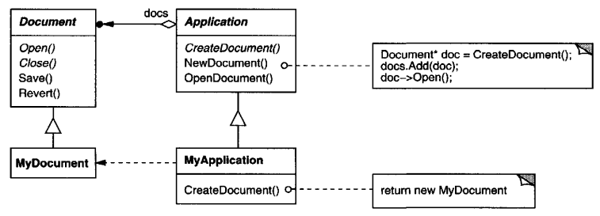
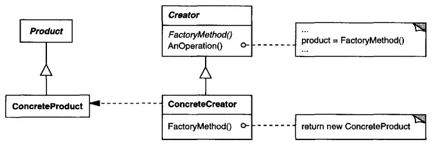
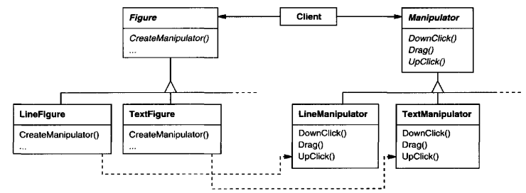

# Factory Method

## Intend
Define an interface for creating an object, but let subclasses decide which class to instantiate. Factory Method lets a class defer instantiation to subclasses.

## Also Known As
Virtual Constructor

## Motivation
Frameworks use abstract classes to define and maintain relationships between objects. A framework is often responsible for creating these objects as well.

Consider a framework for applications that can present multiple documents to the user. Two key abstractions in this framework are the classes Application and Document. Both classes are abstract, and clients have to subclass them to realize their application-specific implementations. To create a drawing application, for example, we define the classes DrawingApplication and DrawingDocument. The Application class is responsible for managing Documents and will create them as required - when the user selects Open or New from a menu, for example.

Because the particular Document subclass to instantiate is application-specific, the Application class can't predict the subclass of Document to instantiate - the Application class only knows *when* a new document should be created, now *what kind* of Document to create. This creates a dilemma: The framework must instantiate classes, but it only knows about abstract classes, which it cannot instantiate.

The Factory Method pattern offers a solution. It encapsulates the knowledge of which Document subclass to create and moves this knowledge out of the framework.

Application subclasses redefine ab abstract CreateDocument operation on Application to return the appropriate Document subclass. Once an Application subclass is instantiated, it can then instantiate application-specific Documents without knowing their class. We call CreateDocument a **factory method** because it's responsible for "manufacturing" an object.

## Applicability
Use the Factory Method pattern when
- a class can't anticipate the class of objects it must create.
- a class wants its subclasses to specify the objects it creates.
- classes delegate responsibility to one of several helper subclasses, and you want to localize the knowledge of which helper subclass is the delegate.

## Structure

## Participants

- **Product** (Document)
    - defines the interface of objects the factory method creates.
- **ConcreteProduct** (MyDocument)
    - implements the Product interface.
- **Creator** (Application)
    - declares the factory method, which returns an object of type Product. Creator may also define a default implementation of the factory method that returns a default ConcreteProduct object.
    - may call the factory method to create a Product object.
- **ConcreteCreator** (My Application)
    - overrides the factory method to return an instance of a ConcreteProduct.

## Collaborations
- Creator relies on its subclasses to define the factory method so that it returns an instance of the appropriate ConcreteProduct.

## Consequences
Factory methods eliminate the need to bind application-specific classes into your code. The code only deals with the Product interface; therefore it can work with any user-defined ConcreteProduct classes.

A potential disadvantage of factory methods is that clients might have to subclass the Creator class just to create a particular ConcreteProduct object. Subclassing is fine when the client has to subclass the Creator class anyway, but otherwise the client now must deal with another point of evolution.

Here are two additional consequences of the Factory Method pattern:
1. **Provides hooks for subclasses.** Creating objects inside a class with a factory method is always more flexible than creating an object directly. Factory Method gives subclasses a hook for providing an extended version of an object.
    
    In the Document example, the Document class could define a factory method called CreateFileDialog that creates a default file dialog object for opening an existing document. A Document subclass can define an application-specific file dialog by overriding this factory method. In this case the factory method is not abstract but provides a reasonable default implementation.

2. **Connects parallel class hierarchies.** In the examples we've considered so far, the factory method is only called by Creators. But this doesn't have to be the case; clients can find factory methods useful, especially in the case of parallel class hierarchies.

    Parallel class hierarchies result when a class delegates some of its responsibilities to a separate class. Consider graphical figures that can be manipulated interactively; that is, they can be stretched, moved, or rotated using the mouse. Implementing such interactions isn't always easy. It often requires storing and updating information that records the state of the manipulation at a given time. This state is needed only during manipulation; therefore it needn't be kept in the figure object. Moreover, different figures behave differently when the user manipulates them. For example, stretching a line figure might have the effect of moving an endpoint, whereas stretching a text figure may change its line spacing.

    With these constraints, it's better to use a separate Manipulator object that implements the interaction and keeps track of any manipulation-specific state that's needed. Different figures will use different Manipulator subclasses to handle particular interactions. The resulting Manipulator class hierarchy parallels (at least partially) the Figure class hierarchy:

The Figure class provides a CreateManipulator factory method that lets clients create a Figure's corresponding Manipulator. Figure subclasses override this method to return an instance of the Manipulator subclass that's right for them. Alternatively, the Figure class may implement CreateManipulator to return a default Manipulator instance, and Figure subclasses may simply inherit that default. The Figure classes that do so need no corresponding Manipulator subclass-hence the hierarchies are only partially parallel.

Notice how the factory method defines the connection between the two class hierarchies. It localizes knowledge of which classes belong together.

## Implementation
Consider the following issues when applying the Factory Method pattern:
1. **Two major varieties.** The two main variations of the Factory Method pattern are (1) the case when the Creator class is an abstract class and does not provide an implementation for the factory method it declares, and (2) the case when the Creator is a concrete class and provides a default implementation for the factory method. It's also possible to have an abstract class that defines a default implementation, but this is less common.

    The first case *requires* subclasses to define an implementation, because there's no reasonable default. It gets around the dilemma of having to instantiate unforeseeable classes. In the second case, the concrete Creator uses the factory method primarily for flexibility. It's following a rule that says, "Create objects in a separate operation so that subclasses can override the way they're created." This rule ensures that designers of subclasses can change the class of objects their parent class instantiates if necessary.
2. **Parameterized factory methods.** Another variation on the pattern lets the factory method create *multiple* kinds of products. The factory method takes a parameter that identifies the kind of object to create. All objects the factory method creates will share the Product interface. In the Document example, Application might support different kinds of Documents. You pass CreateDocument an extra parameter to specify the kind of document to create.

    The Unidraw graphical editing framework uses this approach for reconstructing objects saved on disk. Unidraw defines a **Creator** class with a factory method **Create** that takes a class identifier as an argument. The class identifier specifies the class to instantiate. When Unidraw saves an object to disk, it writes out the class identifier first and then its instance variables. When it reconstructs the object from disk, it reads the class identifier first.

    Once the class identifier is read, the framework called **Create**, passing the identifier as the parameter. **Create** looks up the constructor for the corresponding class and uses it to instantiate the object. Last, **Create** calls the object's **Read** operation, which reads the remaining information on the disk and initializes the object's instance variables.
3. **Language-specific variants and issues.** Different languages lend themselves to other interesting variations and caveats.

    Smalltalk programs often use a method that returns the class of the object to be instantiated. A Creator factory method can use this value to create a product, and a ConcreteCreator may store or even compute this value. The result is an even later binding for the type of concreteProduct to be instantiated.

    Factory methods in C++ are always virtual functions and are often pure virtual. Just be careful ot to call factory methods in the Creator's constructor - the factory method in the ConcreteCreator won't be available yet.

    You can avoid this by being careful to access products solely through accessor operations that create the product on demand. Instead of creating the concrete product in the constructor, the constructor merely initializes it to 0. The accessor return the product. But first it checks to make sure the product exists, and if it doesn't, the accessor creates it. This technique is sometimes called **lazy initialization**. 
4. **Using templates to avoid subclassing.** As we've mentioned, another potential problem with factory methods is that they might force you to subclass just to create the appropriate Product object. Another way to get around this in C++ is to provide a template subclass of Creator that's parameterized by the Product class. With this template, the client supplies just the product class - no subclassing of Creator is required.
5. **Naming conventions.** It's good practice to use naming conventions that make it clear you're using factory methods. For example, the MacApp Macintosh application framework always declares the abstract operation that defines the factory method as **Class\* DoMakeClass()**, where **Class** is the Product class.

## Related Patterns
[Abstract Factory](<../2.1.1 Abstract Factory/Abstract Factory.md>) is often implemented with factory methods. The Motivation example in the Abstract Factory pattern illustrates Factory Method as well.

Factory methods are usually called within [Template Method](<../../2.3 Behavioral Patterns/2.3.10 Template Method/TemplateMethod.md>). In the document example above, NewDocument is a template method.

[Prototypes](<../2.1.4 Prototype/Prototype.md>) don't require subclassing Creator. However, they often require an Initialize operation on the Product class. Creator uses Initialize to initialize the object. Factory Method doesn't require such an operation.