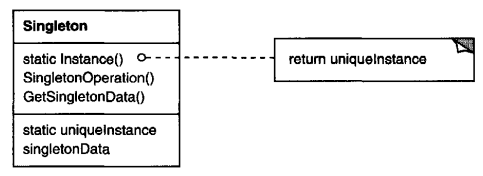

# Singleton

## Intent
Ensure a class only has one instance, and provide a global point of access to it.

## Motivation
It's important for some classes to have exactly one instance. Although there can be many printers in a system, there should be only one printer spooler. There should be only one file system and one window manager. A digital filter will have one A/D converter. An accounting system will be dedicated to serving one company.

How do we ensure that a class has only one instance and that the instance is easily accessible? A global variable makes an object accessible, but it doesn't keep you from instantiating multiple objects.

A better solution is to make the class itself responsible for keeping track of its sole instance. The class can ensure that no other instance can be created (by intercepting requests to create new objects), and it can provide a way to access the instance. This is the Singleton pattern.

## Applicability
Use the Singleton pattern when
- there must be exactly one instance of a class, and it must be accessible to clients from a well-known access point.
- when the sole instance should be extensible by subclassing, and clients should be able to use an extended instance without modifying their code.

## Structure

## Participants
- **Singleton**
    - defines an Instance operation that lets clients access its unique instance. Instance is a class operation (that is, a class method in Smalltalk and a static member function in C++).
    - may be responsible for creating its own unique instance.

## Collaborations
- clients access a Singleton instance solely through singleton's Instance operation.

## Consequences
The Singleton patter has several benefits:
1. **Controlled access to sole instance.** Because the Singleton class encapsulates its sole instance, it can have strict control over how and when clients access it.
2. **Reduced name space.** The Singleton pattern is an improvement over global variables. It avoids polluting the name space with global variables that store sole instances.
3. **Permits refinement of operations and representation.** The Singleton class may be subclasses, and it's easy to configure an application with an instance of this extended class. you can configure the application with an instance of the class you need at run-time.
4. **Permits a variable number of instances.** The pattern makes it easy to change your mind and allow more than one instance of the Singleton class. Moreover, you can use the same approach to control the number of instances that the application uses. Only the operation that grants access to the Singleton instance needs to change.
5. **More flexible than class operations.** Another way to package a singleton's functionality is to use class operations (that is, static member functions in C++ or class methods in Smalltalk). But both of these language techniques make it hard to change a design to allow more than one instance of a class. Moreover, static member functions in C++ are never virtual, so subclasses con't override them polymorphically.

## Implementation
Here are implementation issues to consider when using the Singleton pattern:
1. **Ensuring a unique instance.** The Singleton pattern makes the sole instance a normal instance of a class, but that class is written so that only one instance can ever be created. A common way to do this is to hide the operation that creates the instance behind a class operation (that is, either a static member function or a class method) that guarantees only one instance is created. This operation has access to the variable that holds the unique instance, and it ensures the variable is initialized with the unique instance before returning its value. This approach ensures that a singleton is created and initialized before its first use.

    It isn't enough to define the singleton as a global or static object and then rely on automatic initialization. There are three reasons for this:

    a) We can't guarantee that only one instance of a static object will ever be declared.

    b) We might not have enough information to instantiate every singleton at static initialization time. A singleton might require values that are computed later in the program's execution.

    c) C++ doesn't define the order in which constructors for global objects are called across translation units. This means that no dependencies can exist between singletons; if any do, then errors are inevitable.

    An added (albeit small) liability of the global/static object approach is that it forces all singletons to be created whether they are used or not. Using a static member function avoids all these problems.

2. **Subclassing the Singleton class.** The main issue is not so much defining the subclass but installing its unique instance so that clients will be able to use it. In essence, the variable that refers to the singleton instance must get initialized with an instance of the subclass. The simplest technique is to determine which singleton you want to use in the Singleton's **Instance** operation.

    Another way to choose the subclass of Singleton is to take the implementation of **Instance** out of the parent class and put it in the subclass. That lets a C++ programmer decide the class of singleton at link-time (e..g., by linking in an object file containing a different implementation) but keeps it hidden from the clients of the singleton.

    The link approach fixes the choice of singleton class at link-time, which makes it hard to choose the singleton class at run-time. Using conditional statements to determine the subclass is more flexible, but it hard-wires the set of possible Singleton classes. Neither approach is flexible enough in all cases.

    A more flexible approach uses a **registry of singletons**. Instead of having **Instance** define the set of possible Singleton classes, the Singleton classes can register their singleton instance by name in a well-known registry.

    The registry maps between string names and singletons. When **Instance** needs a singleton, it consults the registry, asking for the singleton by name. This registry looks up the corresponding singleton (if it exists) and returns it. This approach frees **Instance** from knowing all possible Singleton classes or instances. All it requires is a common interface for all Singleton classes that includes operations for registry.

## Related Patterns
Many patterns can be implemented using the Singleton pattern. See [Abstract Factory](<../2.1.1 Abstract Factory/Abstract Factory.md>), [Builder](<../2.1.2 Builder/Builder.md>), and [Prototype](<../2.1.4 Prototype/Prototype.md>).
