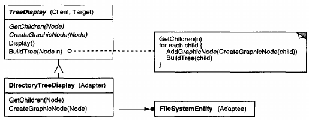

# Adapter

## Intent
Convert the interface of a class into another interface clients expect. Adapter lets classes work together that couldn't otherwise because of incompatible interfaces.

## Also Known As
Wrapper

## Motivation
Sometimes a toolkit class that's designed for reuse isn't reusable only because its interface doesn't match the domain-specific interface an application requires.

Consider for example a drawing editor that lets users draw and arrange graphical elements (lines, polygons, text, etc.) into pictures and diagrams. The drawing editor's key abstraction is the graphical object, which has an editable shape and can draw itself. The interface for graphical objects is defined by an abstract class called Shape. The editor defines a subclass of Shape for each kind of graphical object: a LineShape class for lines, a PolygonShape class for polygons, and so forth.

Classes for elementary geometric shapes like LineShape and PolygonShape are rather easy to implement, because their drawing and editing capabilities are inherently limited. But a TextShape subclass that can display and edit text is considerably more difficult to implement, since even basic text editing involves complicated screen update and buffer management. Meanwhile, an off-the-shelf user interface toolkit might already provide a sophisticated TextView class for displaying and editing text. Ideally we'd like to reuse TextView to implement TextShape, but the toolkit wasn't designed with Shape classes in mind. So we can't use TextView and Shape objects interchangeably.

How can existing and unrelated classes like TextView work in an application that expects classes with a different and incompatible interface? We could change the TextView class so that it conforms to the Shape interface, but that isn't an option unless we have the toolkit's source code. Even if we did, it wouldn't make sense to change TextView; the toolkit shouldn't have to adopt domain-specific interfaces just to make one application work.

Instead, we could define TextShape so that it adapts the TextView interface to Shape's. We can do this in one of two ways: (1) by inheriting Shape's interface and Text View's implementation or (2) by composing a TextView instance within a TextShape and implementing TextShape in terms of TextView's interface. These two approaches correspond to the class and object versions of the Adapter pattern. We call TextShape an **adapter**.

This diagram illustrates the object adapter case. It shows how BoundingBox requests, declared in class Shape, are converted to GetExtent requests defined in TextView. Since TextShape adapts Text View to the Shape interface, the drawing editor can reuse the otherwise incompatible TextView class.

Often the adapter is responsible for functionality the adapted class doesn't provide. The diagram shows how an adapter can fulfill such responsibilities. The user should be able to "drag" every Shape object to a new location interactively, but Text View isn't designed to do that. TextShape can add this missing functionality by implementing Shape's CreateManipulator operation, which returns an instance of the appropriate Manipulator subclass.

Manipulator is an abstract class for objects that know how to animate a Shape in response to user input, like dragging the shape to a new location. There are subclasses of Manipulator for different shapes; TextManipulator, for example, is the corresponding subclass for TextShape. By returning a TextManipulator instance, TextShape adds the functionality that Text View lacks but Shape requires.

## Applicability
Use the Adapter pattern when
- you want to use an existing class, and its interface does not match the one you need.
- you want to create a reusable class that cooperates with unrelated or unforeseen classes, that is, classes that don't necessarily have compatible interfaces.
- (*object adapter only*) you need to use several existing subclasses, but it's impractical to adapt their interface by subclassing every one. An object adapter can adapt the interface of its parent class.

## Structure
A class adapter uses multiple inheritance to adapt one interface to another.

An object adapter relies on object composition.

## Participants
- **Target** (Shape)
    - defines the domain-specific interface that Client uses.
- **Client** (DrawingEditor)
    - collaborates with objects conforming to the Target interface.
- **Adaptee** (TextView)
    - defines an existing interface that needs adapting.
- **Adapter** (TextShape)
    - adapts the interface of Adaptee to the Target interface.

## Collaborations
- Clients call operations on an Adapter instance. In turn, the adapter calls Adaptee operations that carry out the request.

## Consequences
Class and object adapters have different trade-offs. A **class adapter**
- adapts Adaptee to Target by committing to a concrete Adaptee class. As a consequence, a class adapter won't work when we want to adapt a class and all its subclasses.
- lets Adapter override some of Adaptee's behavior, since Adapter is a subclass of Adaptee.
- introduces only one object, and no additional pointer indirection is needed to get to the adaptee.

An **object adapter**
- lets a single Adapter work with many Adaptees - that is, the Adaptee itself and all of its subclasses (if any). The Adapter can also add functionality to all Adaptees at once.
- makes it harder to override Adaptee behavior. It will require subclassing Adaptee and making Adapter refer to the subclass rather than the Adaptee itself.

Here are other issues to consider when using the Adapter pattern:
1. **How much adapting does Adapter do?**?= Adapters vary in the amount of work they do to adapt Adaptee to the Target interface. There is a spectrum of possible work, from simple interface conversion - for example, changing the names of operations - to supporting an entirely different set of operations. The amount of work Adapter does depends on how similar the Target interface is to Adaptee's.
2. **Pluggable adapters.** A class is more reusable when you minimize the assumptions other classes must make to use it. By building interface adaptation into a class, you eliminate the assumption that other classes see the same interface. Put another way, interface adaptation lets us incorporate our class into existing systems that might expect different interfaces to the class. Object-Works\Smalltalk uses the term **pluggable adapter** to describe classes with built-in interface adaptation.

    Consider a TreeDisplay widget that can display tree structures graphically. If this were a special-purpose widget for use in just one application, then we might require the objects that it displays to have specific interface; that is, all must descend from a Tree abstract class. But if we wanted to make TreeDisplay more reusable (say we wanted to make it part of a toolkit of useful widgets), then that requirement would be unreasonable. Applications will define their own classes for tree structures. They shouldn't be forced to use our Tree abstract class. Different tree structures will have different interfaces.

    In a directory hierarchy, for example, children might be accessed with a GetSubdirectories operation, whereas in an inheritance hierarchy, the corresponding operation might be called GetSubclasses. A reusable TreeDisplay widget must be able to display both kinds of hierarchies even if they use different interfaces. In other words, the TreeDisplay should have interface adaptation built into it.
3. **Using two-way adapters to provide transparency.** A potential problem with adapters is that they aren't transparent to all clients. An adapted object no longer conforms to the Adaptee interface, so it can't be used as is wherever an Adaptee object can. **Two-way adapters** can provide such transparency. Specifically, they're useful when two different clients need to view an object differently.

    Consider the two-way adapter that integrates Unidraw, a graphical editor framework, and QOCA, a constraint-solving toolkit. Both systems have classes that represent variables explicitly: Unidraw has StateVariable, and QOCA has ConstraintVariable. To make Unidraw work with QOCA, ConstraintVariable must be adapted to StateVariable; to let QOCA propagate solutions to Unidraw, StateVariable must be adapted to ConstraintVariable.

    
    
    The solution involves a two-way class adapter ConstraintStateVariable, a subclass of both StateVariable and ConstraintVariable, that adapts the two interfaces to each other. Multiple inheritance is a viable solution in this case because the interfaces of the adapted classes are substantially different. The two-way class adapter conforms to both of the adapted classes and can work in either system.

## Implementation
Although the implementation of Adapter is usually straightforward, here are some issues to keep in mind:
1. **Implementing class adapters in C++.** In a C++ implementation of a class adapter, Adapter would inherit publicly from Target and privately from Adaptee. Thus Adapter would be a subtype of Target but not of Adaptee.
2. **Pluggable adapters.** Let's look at three ways to implement pluggable adapters for the TreeDisplay widget describes earlier, which can lay out and display a hierarchical structure automatically.
    
    The first step, which is common to all three of the implementations discussed here, is to find a "narrow" interface for Adaptee, that is, the smallest subset of operations that lets us do the adaptation. A narrow interface consisting of only a couple of operations is easier to adapt than an interface with dozens of operations. For TreeDisplay, the adaptee is any hierarchical structure. A minimalist interface might include two operations, one that defines how to present a node in the hierarchical structure graphically, and another that retrieves the node's children.

    The narrow interface leads to three implementation approaches:

    (a) **Using abstract operations**. Define corresponding abstract operations for the narrow Adaptee interface in the TreeDisplay class. Subclasses must implement the abstract operations and adapt the hierarchically structured object. For example, a DirectoryTreeDisplay subclass will implement these operations by accessing the directory structure.

    

    DirectoryTreeDisplay specializes the narrow interface so that it can display directory structures made up of FileSystemEntity objects.

    (b) **Using delegate objects**. In this approach, TreeDisplay forwards requests for accessing the hierarchical structure to a **delegate** object. TreeDisplay can use a different adaptation strategy by substituting a different delegate.

    For example, suppose there exists a DirectoryBrowser that uses a TreeDisplay. DirectoryBrowser might make a good delegate for adapting TreeDisplay to the hierarchical directory structure. In dynamically typed languages like Smalltalk or Objective-C, this approach only requires an interface for registering the delegate with the adapter. Then TreeDisplay simply forwards the requests to the delegate. NEXTSTEP uses this approach heavily to reduce subclassing.

    Statically typed languages like C++ require an explicit interface definition for the delegate. We can specify such an interface by putting the narrow interface that TreeDisplay requires into an abstract TreeAccessorDelegate class. Then we can mix this interface into the delegate of our choice - DirectoryBrowser in this case - using inheritance. We use single inheritance if the DirectoryBrowser has no existing parent class, multiple inheritance if it does. Mixing classes together like this is easier than introducing a new TreeDisplay subclass and implementing its operations individually.

    

    (c) **Parameterized adapters.** The usual way to support pluggable adapters in Smalltalk is to parameterize an adapter with one or more blocks. The construct supports adaptation without subclassing. A block can adapt a request, and the adapter can store a block for each individual request. In our example, this means TreeDisplay stores one block for converting a node into a GraphicalNode and another block for accessing a node's children.

    If you're building interface adaptation into a class, this approach offers a convenient alternative to subclassing.

## Related Patterns
[Bridge](<../2.2.2 Bridge/Bridge.md>) has a structure similar to an object adapter, but Bridge has a different intent: It is meant to separate an interface from its implementation so that they can be varied easily and independently. An adapter is meant to change the interface of an **existing** object.

[Decorator](<../2.2.4 Decorator/Decorator.md>) enhances another object without changing its interface. A decorator is thus more transparent to the application than an adapter is. As a consequence, Decorator supports recursive composition, which isn't possible with pure adapters.

[Proxy](<../2.2.7 Proxy/Proxy.md>) defines a representative or surrogate for another object and does not change its interface.