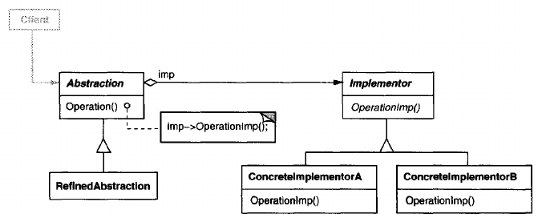

# Bridge

## Intent
Decouple an abstraction from its implementation so that the two can vary independently.

## Also Known As
Handle / Body

## Motivation
When an abstraction can have one of several possible implementations, the usual way to accommodate them is to use inheritance. An abstract class defines the interface to the abstraction, and concrete subclasses implement it in different ways. But this approach isn't always flexible enough.  Inheritance binds an implementation to the abstraction permanently, which makes it difficult to modify, extend, and reuse abstractions and implementations independently.

Consider the implementation of a portable Window abstraction in a user interface toolkit. This abstraction should enable us to write applications that work on both the X Window System and IBM's Presentation Manager (PM), for example. Using inheritance, we could define an abstract class Window and subclasses XWindow and PMWindow that implement the Window interface for the different platforms. But this approach has two drawbacks:
1. It's inconvenient to extend the Window abstraction to cover different kinds of windows or new platforms. Imagine an IconWindow subclass of Window that specializes the Window abstraction for icons. To support IconWindows for both platforms, we have to implement *two* new classes, XIconWindow and PMIconWindow. Worse, we'll have to define two classes for *every* kind of window. Supporting a third platform requires yet another new Window subclass for every kind of window.

    
2. It makes client code platform-dependent. Whenever a client creates a window, it instantiates a concrete class that has a specific implementation. For example, creating an XWindow object binds the Window abstraction to the X Window implementation, which makes the client code dependent on the X Window implementation. This, in turn, makes it harder to port the client code to other platforms.

    Clients should be able to create a window without committing to a concrete implementation. Only the window implementation should depend on the platform on which the application runs. Therefore client code should instantiate windows without mentioning specific platforms.

The Bridge pattern addresses these problems by putting the Window abstraction and its implementation in separate class hierarchies. There is one class hierarchy for window interfaces (Window, IconWindow, TransientWindow) and a separate hierarchy for platform-specific window implementations, with WindowImp as its root. The XWindowImp subclass, for example, provides an implementation based on the X Window System.


All operations on Window subclasses are implemented in terms of abstract operations from the WindowImp interface. This decouples the window abstractions from the various platform-specific implementations. We refer to the relationship Window and WindowImp as a **bridge**, because it bridges the abstraction and its implementation. letting them vary independently.

## Applicability
Use the Bridge pattern when
- you want to avoid a permanent binding between an abstraction and its implementation. This might be the case, for example, when the implementation must be selected or switched at run-time.
- both the abstractions and their implementations should be extensible by subclassing. In this case, the Bridge pattern lets you combine the different abstractions and implementations and extend them independently.
- changes in the implementation of an abstraction should have no impact on clients; that is, their code should not have to be recompiled.
- (C++) you want to hide the implementation of an abstraction completely from clients. In C++ the representation of a class is visible in the class interface.
- you have a proliferation of classes as shown earlier in the first Motivation diagram. Such a class hierarchy indicates the need for splitting an object into two parts. Rumbaugh uses the term "nested generalizations" to refer to such class hierarchies.
- you want to share an implementation among multiple objects (perhaps using reference counting), and this fact should be hidden from the client. A simple example is Coplien's String class, in which multiple objects can share the same string representation (StringRep).

## Structure


## Participants
- **Abstraction** (Window)
    - defines the abstraction's interface.
    - maintains a reference to an object of type Implementor.
- **RefinedAbstraction** (IconWindow)
    - Extends the interface defined by Abstraction.
- **Implementor** (WindowImp)
    - defines the interface for implementation classes. This interface doesn't have to correspond exactly to Abstraction's interface; in fact the two interfaces can be quite different. Typically the Implementor interface provides only primitive operations, and Abstraction defines higher-level operations based on these primitives.
- **ConcreteImplementor** (XWindowImp, PMWindowImp)
    - implements the Implementor interface and defines its concrete implementation.

## Collaborations
- Abstraction forwards client requests to its Implementor object.

## Consequences
The Bridge pattern has the following consequences:
1. **Decoupling interface and implementation.** An implementation is not bound permanently to an interface. The implementation of an abstraction can be configured at run-time. It's even possible for an object to change its implementation at run-time.

    Decoupling Abstraction and Implementor also eliminates compile-time dependencies on the implementation. Changing an implementation class doesn't require recompiling the Abstraction class and its clients. This property is essential when you must ensure binary compatibility between different versions of a class library. 

    Furthermore, this decoupling encourages layering that can lead to a better-structured system. The high-level part of a system only has to known about Abstraction and Implementor.
2. **Improved extensibility.** You can extend the Abstraction and Implementor hierarchies independently.
3. **Hiding implementation details from clients.** You can shield clients from implementation details, like the sharing of implementor objects and the accompanying reference count mechanism (if any).

## Implementation
Consider the following implementation issues when applying the Bridge pattern:
1. **Only one Implementor.** In situations where there's only one implementation, creating an abstract Implementor class isn't necessary. This is a degenerate case of the Bridge pattern; there's a one-to-one relationship between Abstraction and Implementor. Nevertheless, this separation is still useful when a change in the implementation of a class must not affect its existing clients - that is, they should'nt have to be recompiled, just relinked.

    Carolan uses term "Cheshire Cat" to describe this separation. In C++, the class interface of the Implementor class can be defined in a private header file that isn't provided to clients. This lets you hide an implementation of a class completely from its clients.
2. **Creating the right Implementor object.** How, when, and where do you decide which Implementor class to instantiate when there's more than one?

    If Abstraction knowns about all ConcreteImplementor classes, then it can instantiate one of them in its constructor; it can decide between them based on parameters passed to its constructor. If, for example, a collection class supports multiple implementations, the decision can be based on the size of the collection. A linked list implementation can be used for small collections and a hash table for larger ones.

    Another approach is to choose a default implementation initially and change it later according to usage. For example, if the collection grows bigger than a certain threshold, then it switches its implementation to one that's more appropriate for a large number of items.

    It's also possible to delegate the decision to another object altogether. In the Window / WindowImp example, we can introduce a factory object (see [Abstract Factory](<../../2.1 Creational Patterns/2.1.1 Abstract Factory/Abstract Factory.md>)) whose sole duty is to encapsulate platform-specifics. The factory knows what kind of WindowImp object to create for the platform in use; a Window simply asks it for a WindowImp, and it returns the right kind. A benefit of this approach is that Abstraction is not coupled directly to any of the Implementor classes.
3. **Sharing implementors.** Coplien illustrates how the Handle / Body idiom in C++ can be used to share implementations among several objects. The Body stores a reference count that the Handle class increments and decrements. The code for assigning handles with shared bodies has the following general form:
    
    ```
    Handle& Handle::operator= (const Handle& other){
        other._body->Ref();
        _body->Unref();

        if (_body->RefCount() == 0) {
            delete _body;
        }
        _body = other._body;

        return *this;
    }
    ```
4. **Using multiple inheritance.** You can use multiple inheritance in C++ to combine an interface with its implementation. For example, a class can inherit publicly from Abstraction and privately from a ConcreteImplementor. But because this approach relies on static inheritance, it binds an implementation permanently to its interface. Therefore, you can't implement a true Bridge with multiple inheritance - at least not in C++.

## Related Patterns
An [Abstract Factory](<../../2.1 Creational Patterns/2.1.1 Abstract Factory/Abstract Factory.md>) can create and configure a particular Bridge.

The [Adapter](<../2.2.1 Adapter/Adapter.md>) pattern is geared toward making unrelated classes work together. It is usually applied to systems after they're designed. Bridge, on the other hand, is used up-front in a design to let abstractions and implementations vary independently.