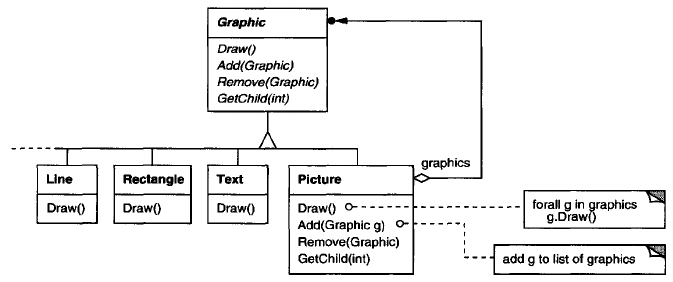
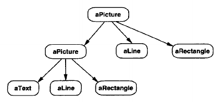
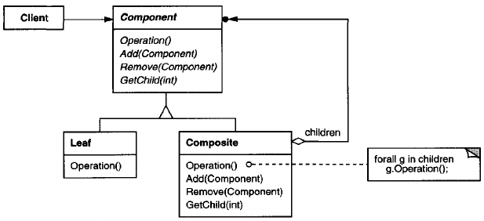

# Composite

## Intent
Compose objects into tree structures to represent part-whole hierarchies. Composite lets clients treat individual objects and compositions of objects uniformly. 

## Motivation
Graphics applications like drawing editors and schematic capture systems let users build complex diagrams out of simple components. The use can group components to form larger components, which in turn can be grouped to form still larger components. A simple implementation could define classes for graphical primitives such as Text and Lines plus other classes that act as containers for these primitives.

But there's a problem with this approach: Code that uses these classes must treat primitive and container objects differently, even if most of the time the use treats them identically. Having to distinguish these objects makes the application more complex. The Composite pattern describes how to use recursive composition so that clients don't have to make this distinction.



The key to the Composite pattern is an abstract class that represents *both* primitives and their containers. For the graphics system, this class is Graphic. Graphic declares operations like Draw that are specific to graphical objects. It also declares operations that all composite objects share, such as operations for accessing and managing its children.

The subclasses Line, Rectangle, and Text define primitive graphical objects. These classes implement Draw to draw lines, rectangles, and text, respectively. Since primitive graphics have no child graphics, none of these subclasses implements child-related operations.

The Picture class defines an aggregate of Graphic objects. Picture implements Draw to call Draw on its children, and it implements child-related operations accordingly. Because the Picture interface conforms to the Graphic interface, Picture objects can compose other Pictures recursively.

The following diagram shows a typical composite object structure of recursively composed Graphic objects:



## Applicability
Use the Composite pattern when
- you want to represent part-whole hierarchies of objects.
- you want clients to be able to ignore the difference between compositions of objects and individual objects. Client will treat all objects in the composite structure uniformly.

## Structure


A typical Composite object structure might look like this:


## Participants
- **Component** (Graphic)
    - declares the interface for objects in the composition.
    - implements default behavior for the interface common to all classes, as appropriate.
    - declares an interface for accessing and managing its child components.
    - (optional) defines an interface for accessing a component's parent in the recursive structure for primitive objects in the composition.
- **Leaf** (Rectangle, Line, Text, etc.)
    - represents leaf objects in the composition. A leaf had no children.
    - defines behavior for primitive objects in the composition.
- **Composite** (Picture)
    - defines behavior for components having children.
    - stores child components.
    - implements child-related operations in the Component interface.
- **Client**
    - manipulates objects in the composition through the Component interface.

## Collaborations
- Clients use the Component class interface to interact with objects in the composite structure. If the recipient is a Leaf, then the request is handled directly. If the recipient is a Composite, then it usually forwards requests to its child components, possibly performing additional operations before and/or after forwarding.

## Consequences
The Composite pattern
- defines class hierarchies consisting of primitive objects and composite objects. Primitive objects can be composed into more complex objects, which in turn can be composed, and so on recursively. Wherever client code expects a primitive object, it can also take a composite objects.
- makes the client simple. clients can treat composite structures and individual objects uniformly. Clients normally don't know (and shouldn't care) whether they're dealing with a leaf or a composite component. This simplifies client code, because it avoids having to write tag-and-case-statement-style functions over the classes that define the composition.
- make it easier to add new kinds of components. Newly defined Composite or Leaf subclasses work automatically with existing structures and client code. Clients don't have to be changed for new Component classes.
- can make your design overly general. The disadvantage of making it easy to add new components is that it makes it harder to restrict the components of a composite. Sometimes you want a composite to have only certain components. With composite, you can't rely on the type system to enforce those constraints for you. You'll have to use run-time checks instead.

## Implementation
There are many issues to consider when implementing the Composite pattern:
1. **Explicit parent references.** Maintaining references from child components to their parent can simplify the traversal and management of a composite structure. The parent reference simplifies moving up the structure and deleting a component. Parent references also help support the Chain of Responsibility pattern.

    The usual place to define the parent reference is in the Component class. Lead and Composite classes can inherit the reference and the operations that manage it.

    With parent references, it's essential to maintain the invariant that all children of a composite have as their parent the composite that in turn has them as children. The easiest way to ensure this is to change a component's parent *only* when it's being added or removed from a composite. If this can be implemented once in the Add and Remove operations of the Composite class, then it can be inherited by all the subclasses, and the invariant will be maintained automatically.
2. **Sharing components.** It's often useful to share components, for example, to reduce storage requirements. But when a component can have no more than one parent, sharing components becomes difficult.

    A possible solution is for children to store multiple parents. But that can lead to ambiguities as a request propagates up the structure. The Flyweight pattern shows how to rework a design to avoid storing parents altogether. It works in cases where children can avoid sending parent requests by externalizing some or all of their state.
3. **Maximizing the Component interface.** One of the goals of the Composite pattern is to make clients unaware of the specific Leaf or Composite classes they're using. To attain this goal, the Component class should define as many common operations for Composite and Leaf classes as possible. The Component class usually provides default implementations for these operations, and Leaf and Composite subclasses will override them. 

    However, this goal will sometimes conflict with the principle of class hierarchy design that says a class should only define operations that are meaningful to its subclasses. There are many operations that Component supports that don't seem to make sense for Leaf classes. How can Component provide a default implementation for them?

    Sometimes a little creativity shows how an operation that would appear to make sense only for Composites can be implemented for all Components by moving it to the Component class. For example, the interface for accessing children is a fundamental part of a Composite class but not necessarily Leaf classes. But if we view a Leaf as a Component that *never* has children, then we can define a default operation for child access in the Component class that never *returns* any children. Leaf classes can use the default implementation, but Composite classes will reimplement it to return their children.

    The child management operations are more troublesome and are discussed in the next item.
4. **Declaring the child management operations.** Although the Composite class *implements* the Add and Remove operations for managing children, an important issue in the Composite pattern is which classes *declare* these operations in the Composite class hierarchy. Should we declare these operations in the Component and make them meaningful for Leaf classes, or should we declare and define them only in composite and its subclasses?

    The decision involves a trade-off between safety and transparency:
    
    - Defining the child management interface at the root of the class hierarchy gives you transparency, because you can treat all components uniformly. It costs you safety, however, because clients may try to do meaningless things like add and remove objects from leaves.
    - Defining child management in the Composite class gives you safety, because any attempt to add or remove objects from leaves will be caught at compile-time in a statically types language like C++. But you lose transparency, because leaves and composites have different interfaces.

        We have emphasized transparency over safety in this pattern. If you opt for safety, then at times you may lose type information and have to convert a component into a composite. How can you do this without resorting to a type-unsafe cast?

        One approach is to declare an operation ```Composite* GetComposite()``` in the Component class. Component provides a default operation that returns a null pointer. The Composite class redefines this operation to return itself through the **this** pointer:
            
            class Composite;
            class Component {
                public:
                //. . .
                virtual Composite* GetComposite() { return 0; }
            };
            class Composite : public Component {
                public:
                void Add(Component*);
                // . . .
                virtual Composite* GetComposite() { return this; }
            };
            class Leaf : public Component {
                // . . .
            };
            
        **GetComposite** lets you query a component to see if it's a composite. You can perform **Add** and **Remove** safely on the composite it returns.

            Composite* aComposite = new Composite;
            Leaf* aLeaf = new Leaf;

            Component* aComponent;
            Composite* test;

            aComponent = aComposite;
            if (test = aComponent->GetComposite()) {
                test->Add(new Leaf);
            }
            aComponent = aLeaf;
            if (test = aComponent->GetComposite()) {
                test->Add(new Leaf); // will not add leaf
            }
        
        Similar tests for a Composite can be done using the C++ **dynamic_cast** construct.

        Of course, the problem here is that we don't treat all components uniformly. We have to revert to testing for different types before taking the appropriate action.

        The only way to provide transparency is to define default **Add** and **Remove** operations in the Component. That creates a new problem. There's no way to implement ```Component::Add``` without introducing the possibility of it failing. You could make it do nothing, but that ignores an important consideration; that is, an attempt to add something to a leaf probably indicates a bug. In that case, the **Add** operation produces garbage. You could make it delete its argument, but that might not be what client expects.

        Usually it's better to make **Add** and **Remove** fail by default (perhaps by raising an exception) if the component isn't allowed to have children or if the argument of **Remove** isn't a child of the component, respectively.

        Another alternative is to change the meaning of ""remove"" slightly. If the component maintains a parent reference, then we could redefine ```Component::Remove``` to remove itself from its parent. However, there still isn't a meaningful interpretation for a corresponding **Add**.
5. **Should Component implement a list of Components?** You might be tempted to define the set of children as an instance variable in the Component class where the child access and management operations are declared. But putting the child pointer in the base class incurs a space penalty for every leaf, even though a leaf never has children. This is worthwhile only if there are relatively few children in the structure. 
6. **Child ordering.** Many designs specify an ordering on the children of Composite. In the earlier Graphics example, ordering may reflect front-to-back ordering. If Composites represent parse trees, then compound statements can be instances of a Composite whose children must be ordered to reflect the program.

    When child ordering is an issue, you must design child access and management interfaces carefully to manage the sequence of children. The Iterator pattern can guide you in this.
7. **Caching to improve performance.** If you need to traverse or search compositions frequently, the Composite class can cache traversal or search information about its children. The Composite can cache actual results or just information that lets it short-circuit the traversal or search. For example, the Picture class from the Motivation example could cache the bounding box of its children. During drawing or selection, this cached bounding box lets the Picture avoid drawing or searching when its children aren't visible in the current window.

    Changes to a component will require invalidating the caches of its parents. This works best when components know their parents. So if you're using caching, you need to define an interface for telling composites that their caches are invalid.
8. **Who should delete components?** In languages without garbage collection, it's usually best to make a Composite responsible for deleting its children when it's destroyed. An exception to this rule is when Leaf object are immutable and thus can be shared.
9. **What's the best data structure for storing components?** Composites may use a variety of data structures to store their children, including linked lists, trees, arrays, and hash tables. The choice of data structure depends (as always) on efficiency. In fact, it isn't even necessary to use a general-purpose data structure at all. Sometimes composites have a variable for each child, although this requires each subclass of composite to implement its own management interface. See [Interpreter](<../../2.3 Behavioral Patterns/2.3.3 Interpreter/Interpreter.md>) for an example.

## Related Patterns
Often the component-parent link is used for [Chain of Responsibility](<../../2.3 Behavioral Patterns/2.3.1 Chain of Responsibility/Chain of Responsibility.md>).

[Decorator](<../2.2.4 Decorator/Decorator.md>) is often used with Composite. When decorators and composites are used together, they will usually have a common parent class. So decorators will have to support the Component interface with operations like Add,Remove, and GetChild.

[Flyweight](<../2.2.6 Flyweight/Flyweight.md>) lets you share components, but they can no longer refer to their parents.

[Iterator](<../../2.3 Behavioral Patterns/2.3.4 Iterator/Iterator.md>) can be used to traverse composites.

[Visitor](<../../2.3 Behavioral Patterns/2.3.11 Visitor/Visitor.md>) localizes operations and behavior that would otherwise be distributed across Composite and Leaf classes.

