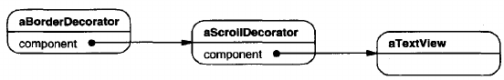
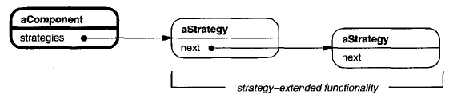

# Decorator

## Intent
Attach additional responsibilities to an object dynamically. Decorators provide a flexible alternative to subclassing for extending functionality.

## Also Known As
Wrapper

## Motivation
Sometimes we want to add responsibilities to individual objects, not to an entire class. A graphical user interface toolkit, for example, should let you add properties like borders or behaviors like scrolling to any user interface component.

One way to add responsibilities is with inheritance. Inheriting a border from another class puts a border around every subclass instance. This is inflexible, however, because the choice of border is made statically. A client can't control how and when to decorate the component with a border.

A more flexible approach is to enclose the component in another object that adds the border. The enclosing object is called a **decorator**. The decorator conforms to the interface of the component it decorates so that its presence is transparent to the component's clients. The decorator forwards requests to the component and may perform additional actions (such as drawing a border) before or after forwarding. Transparency lets you nest decorators recursively, thereby allowing an unlimited number of added responsibilities. 

For example, suppose we have a TextView object that displays text in a window. TextView has no scroll bars by default, because we might not always need them. When we do, we can use a ScrollDecorator to add them. Suppose we also want to add a thick black border around the TextView. We can use a BorderDecorator to add this as well. We simply compose the decorators with the TextView to produce the desired result.

The following object diagram shows how to compose a TextView object with BorderDecorator and ScrollDecorator objects to produce a bordered, scrollable text view:

The ScrollDecorator and BorderDecorator classes are subclasses of Decorator, and abstract class for visual components that decorate other visual components.

VisualComponent is the abstract class for visual objects. It defines their drawing and event handling interface. Note how the Decorator class simply forwards draw requests to its component, and how Decorator subclasses can extend this operation.

Decorator subclasses are free to add operations for specific functionality. For example, ScrollDecorator's ScrollTo operation lets other objects scroll the interface *if* they know there happens to be a ScrollDecorator object in the interface. The important aspect of this pattern is that it lets decorators appear anywhere a VisualComponent can. That way clients generally can't tell the difference between a decorated component and an undecorated one, and so they don't depend at all on the decoration.

## Applicability
Use Decorator
- to add responsibilities to individual objects dynamically and transparently, that is, without affecting other objects.
- for responsibilities that can be withdrawn.
- when extension by subclassing is impractical. Sometimes, a large number of independent extensions are possible and would produce an explosion of subclasses to support every combination. Or a class definition may be hidden or otherwise unavailable for subclassing.

## Structure

## Participants
- **Component** (VisualComponent)
    - defines the interface for objects that can have responsibilities added to them dynamically.
- **ConcreteComponent** (TextView)
    - defines an object to which additional responsibilities can be attached.
- **Decorator**
    - maintains a reference to a Component object and defines an interface that confirms to Component's interface.
- **ConcreteDecorator** (BorderDecorator, ScrollDecorator)
    - adds responsibilities to the component.

## Collaborations
- Decorator forwards requests to its Component object. It may optionally perform additional operations before and after forwarding the request.

## Consequences
The Decorator pattern has at least two key benefits and teo liabilities:
1. **More flexibility than static inheritance.** The Decorator pattern provides a more flexible way to add responsibilities to objects that can be had with static (multiple) inheritance. With decorators, responsibilities can be added and removed at run-time simply by attaching and detaching them. In contrast, inheritance requires creating a new class for each additional responsibility (e.g., BorderedScrollableTextView, BorderedTextView). This gives rise to many classes and increases the complexity of a system. Furthermore, providing different Decorator classes for a specific Component class lets you mix and match responsibilities.

    Decorators also make it easy to add a property twice. For example, to give a TextView a double border, simply attach two BorderDecorators. Inheriting from a Border class twice is error-prone at best.
2. **Avoids feature-laden classes high up in the hierarchy.** Decorator offers a pay-as-you-go approach to adding responsibilities. Instead of trying to support all foreseeable features in a complex, customizable class, you can define a simple class and add functionality incrementally with Decorator objects. Functionality can be composed from simple pieces. As a result, an application needn't pay for features it doesn't use. It's also easy to define new kinds of Decorators independently from the classes of objects they extend, even for unforeseen extensions. Extending a complex class tends to expose details unrelated to the responsibilities you're adding.
3. **A decorator and its component aren't identical.** A decorator acts as a transparent enclosure. But from an object identity point of view, a decorated component is not identical to the component itself. Hence you shouldn't rely on object identity when you use decorators.
4. **Lots of little objects.** A design that uses Decorator often results in systems composed of lots of little objects that all look alike. The objects differ only in the way they are interconnected, not in their class or in the value of their variables. Although these systems are easy to customize by those who understand them, they can be hard to learn and debug.

## Implementation
Several issues should be considered when applying the Decorator pattern:
1. **Interface conformance.** A decorator object's interface must conform to the interface of the component it decorates. ConcreteDecorator classes must therefore inherit from a common class (at least in C++).
2. **Omitting the abstract Decorator class.** There's no need to define an abstract Decorator class when you only need to add one responsibility. That's often the case when you're dealing with an existing class hierarchy rather than designing a new one. In that case, you can merge Decorator's responsibility for forwarding requests to the component into the ConcreteDecorator.
3. **Keeping Component classes lightweight.** To ensure a conforming interface, components and decorators must descend from a common Component class. It's important to keep this common class lightweight; that is, it should focus on defining an interface, not on storing data. The definition of the data representation should be deferred to subclasses; otherwise the complexity of the Component class might make the decorators too heavyweight to use in quantity. Putting a lot of functionality into Component also increases the probability that concrete subclasses will pay for features they don't need.
4. **Changing the skin of an object versus changing its guts.** We can think of a decorator as a skin over an object that changes its behavior. An alternative is to change the object's guts. The Strategy pattern is a good example of a pattern for changing the guts.

    Strategies are a better choice in situations where the Component class is intrinsically heavyweight, thereby making the Decorator pattern too costly to apply. In the Strategy pattern, the component forwards some of its behavior to a separate strategy object. The Strategy pattern lets us alter or extend the component's functionality by replacing the strategy object.

    For example, we can support different border styles by having the component defer border-drawing to a separate Border object. The Border object is a Strategy object that encapsulates a border-drawing strategy. By extending the number of strategies from just one to an open-ended list, we achieve the same effect as nesting decorators recursively.

    In MacApp 3.0 and Bedrock, for example, graphical components (called "views") maintain a list of "adorner" objects that can attach additional adornments like border to a view component. If a view has any adorners attached, then it gives them a chance to draw additional embellishments. MacApp and Bedrock must use this approach because the View class is heavyweight. It would be too expensive to use a full-fledged View just to add a border.

    Since the Decorator pattern only changes a component from the outside, the component doesn't have to known anything about its decorators; that is, the decorators are transparent to the component:
    
    

    With strategies, the component itself knowns about possible extensions. So it has to reference and maintain the corresponding strategies:

    

    The Strategy-based approach might require modifying the component to accommodate new extensions. On the other hand, a strategy can have its own specialized interface, whereas a decorator's interface must conform to the component's. A strategy for rendering a border, for example, need only define the interface for rendering a border (DrawBorder, GetWidth, etc.), which means that the strategy can be lightweight even if the Component class is heavyweight. 

    MacApp and Bedrock use this approach for more than just adorning views. They also use it to augment the event-handling behavior of objects. In both systems, a view maintains a list of "behavior" objects that can modify and intercept events. The view gives each of the registered behavior objects a chance to handle the event before nonregistered behaviors, effectively overriding them. You can decorate a view with special keyboard-handling support, for example, by registering a behavior object that intercepts and handles key events.

## Related Patterns
[Adapter](<../../2.2 Structural Patterns/2.2.1 Adapter/Adapter.md>): A decorator is different from an adapter in that a decorator only changes an object;s responsibilities, not its interface; an adapter will give an object a completely new interface.

[Composite](<../2.2.3 Composite/Composite.md>): A decorator can be viewed as a degenerate composite with only one component. However, a decorator adds additional responsibilities - it isn't intended for object aggregation.

[Strategy](<../../2.3 Behavioral Patterns/2.3.9 Strategy/Strategy.md>): A decorator lets you change the skin of an object; a strategy lets you change the guts. There are two alternative ways of changing an object.

