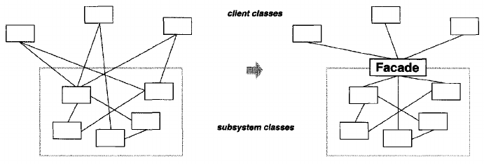
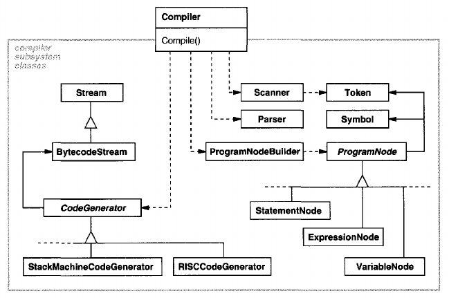
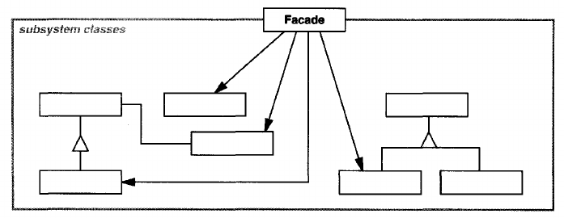

# Facade

## Intent
Provide a unified interface to a set  of interfaces in a subsystem. Facade defines a higher-level interface that makes the subsystem easier to use.

## Motivation
Structuring a system into subsystems helps reduce complexity. A common design goal is to minimize the communication and dependencies between subsystems. One way to achieve this goal is to introduce a **facade** object that provides a single, simplified interface to the more general facilities of a subsystem.

Consider for example a programming environment that gives applications access to its compiler subsystem. This subsystem contains classes such as Scanner, Parser, ProgramNode, BytecodeStream, and ProgramNodeBuilder that implement the compiler. Some specialized applications might need to access these classes directly. But most clients of a compiler generally don't care about details like parsing and code generation; they merely want to compile some code. For them, the powerful but low-level interfaces in the compiler subsystem only complicate their task.

To provide a higher-level interface that can shield clients from these classes, the compiler subsystem also includes a Compiler class. This class defines a unifies interface to the compiler's functionality/ The Compiler class acts as a facade: It offers clients a single, simple interface to the compiler subsystem. It glues together the classes that implement compiler functionality without hiding them completely. The compiler facade makes life easier for most programmers without hiding the lower-level functionality from the few that need it.

## Applicability
Use the Facade pattern when
- you want to provide a simple interface to a complex subsystem. Subsystems often get more complex as they evolve. Most patterns, when applied, result in more and smaller classes. This makes the subsystem more reusable and easier to customize, but it also becomes harder to use for clients that don't need to customize it. A facade can provide a simple default view of the subsystem that is good enough for most clients. Only clients needing more customizability will need to look beyond the facade.
- there are many dependencies between clients and the implementation classes of an abstraction. Introduce a facade to decouple the subsystem from clients and other subsystems, thereby promoting subsystem independence and portability.
- you want to layer your subsystems. Use a facade to define an entry point to each subsystem level. If subsystems are dependent, then you can simplify the dependencies between them by making them communicate with each other solely through their facades.

## Structure

## Participants
- **Facade** (Compiler)
    - knows which subsystem classes are responsible for a request.
    - delegates client requests to appropriate subsystem objects.
- **subsystem classes** (Scanner, Parser, ProgramNode, etc.)
    - implement subsystem functionality.
    - handle work assigned by the Facade object.
    - have no knowledge of the facade; that is, they keep no references to it.

## Collaborations
- Clients communicate with the subsystem by sending requests to Facade, which forwards them to the appropriate subsystem object(s). Although the subsystem object perform the actual work, the facade may have to do work of its own to translate its interface to subsystem interfaces.
- Clients that use the facade don't have to access its subsystem objects directly.

## Consequences
The Facade pattern offers the following benefits:
1. It shields clients from subsystem components, thereby reducing the number of objects that clients deal with and making the subsystem easier to use.
2. It promotes weak coupling between the subsystem and its clients. Often the components in a subsystem are strongly coupled. Weak coupling lets you cary the components of the subsystem without affecting its clients. Facades help layer a system and dependencies between objects. They can eliminate complex or circular dependencies. This can be an important consequence when the client and the subsystem are implemented independently.

    Reducing compilation dependencies is vital in large software systems. You want to save time by minimizing recompilation when subsystem classes change. Reducing compilation dependencies with facades can limit the re-compilation needed for a small change in an important subsystem. A facade can also simplify porting systems to other platforms, because it's less likely that building one subsystem requires building all others.
3. It doesn't prevent applications from using subsystem classes if they need to. Thus you can choose between ease of use and generality.

## Implementation
Consider the following issues when implementing a facade:
1. **Reducing client-subsystem coupling.** The coupling between clients and the subsystem can be reduced even further by making Facade an abstract class with concrete subclasses for different implementations of a subsystem. Then clients can communicate with the subsystem through the interface of the abstract Facade class. This abstract coupling keeps clients from knowing which implementation of a subsystem is used.

    An alternative to subclassing is to configure a Facade object with different subsystem objects. To customize the facade, simply replace one or more of its subsystem objects.
2. **Public versus private subsystem classes.** A subsystem is analogous to a class in that both have interfaces, and both encapsulate something - a class encapsulates state and operations, while a subsystem encapsulates classes. And just as it's useful to think of the public and private interface of a class, we can think of the public and private interface of a subsystem.

    The public interface to a subsystem consists of classes that all clients can access; the private interface is just for subsystem extenders. The Facade class is part of the public interface, of course, but it's not the only part. Other subsystem classes are usually public as well. For example, the classes Parser and Scanner in the compiler subsystem are part of the public interface.

    Making subsystem classes private would be useful, but few object-oriented languages support it. Both C++ and Smalltalk traditionally have had a global name space for classes. Recently, however, the C++ standardization committee added name spaces to the language, which will let you expose just the public subsystem classes.

## Related Patterns
[Abstract Factory](<../../2.1 Creational Patterns/2.1.1 Abstract Factory/Abstract Factory.md>) can be used with Facade to provide an interface for creating subsystem objects in a subsystem-independent way. Abstract Factory can also be used as an alternative to facade to hide platform-specific classes.

[Mediator](<../../2.3 Behavioral Patterns/2.3.5 Mediator/Mediator.md>) is similar to Facade in that it abstracts functionality of existing classes. However, Mediator's purpose is to abstract arbitrary communication between colleague objects, often centralizing functionality that doesn't belong in any one of them. A mediator's colleagues are aware of and communicate with the mediator instead of communicating with each other directly. In contrast, a facade merely abstracts the interface to subsystem objects to make them easier to use; it doesn't define new functionality, and subsystem classes don't know about it. 

Usually only one Facade object is required. Thus Facade objects are often [Singletons](<../../2.1 Creational Patterns/2.1.5 Singleton/Singleton.md>).

