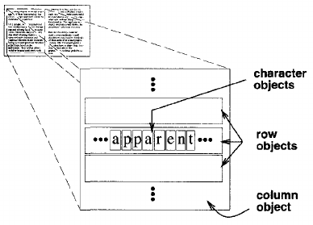
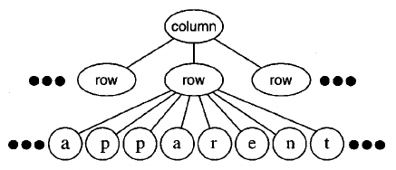
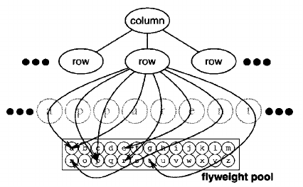
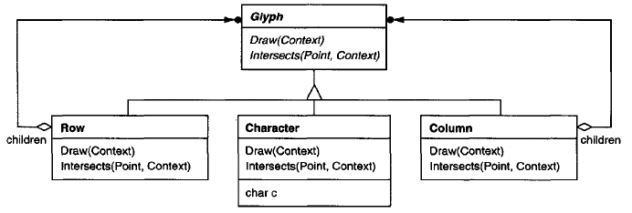
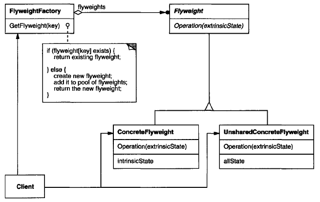
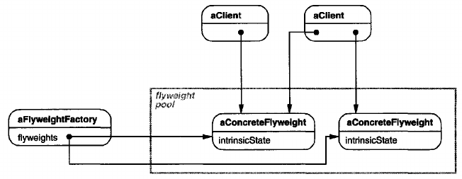

# Flyweight

## Intent
Use sharing to support large numbers of fine-grained objects efficiently.

## Motivation
Some applications could benefit from using objects throughout their design, but a naive implementation would be prohibitively expensive.

For example, most document editor implementations have text formatting and editing facilities that are modularized to some extend. Object-oriented document editors typically use objects to represent embedded elements like tables and figures. However, they usually stop short of using an object for each character in the document, even though doing so would promote flexibility at the finest levels in the application. Characters and embedded elements could then be treated uniformly with respect to how they are drawn and formatted. The application could be extended to support new character sets without disturbing other functionality. The application's object structure could mimic the document's physical structure. The following diagram shows how a document editor can use objects to represent characters.

The drawback of such a design is its cost. Even moderate-sized documents may require hundreds of thousands of character objects, which will consume lots of memory and may incur unacceptable run-time overhead. The Flyweight pattern describes how to share objects to allow their use at fine granularities without prohibitive cost.

A **flyweight** is a shared object that can be used in multiple contexts simultaneously. The flyweight acts as an independent object in each context - it's indistinguishable from an instance of the object that's not shared. Flyweights cannot make assumptions about the context in which they operate. The key concept here is the distinction between **intrinsic** and **extrinsic** state. Intrinsic state is stored in the flyweight; it consists of information that's independent of the flyweight's context, thereby making it sharable. Extrinsic state depends on and varies with the flyweight's context and therefore can't be shared. Client objects are responsible for passing extrinsic state to the flyweight when it needs it. 

Flyweights model concepts or entities that are normally too plentiful to represent with objects. For example, a document editor can create a flyweight for each letter of the alphabet. Each flyweight stores a character code, but its coordinate position in the document and its typographic style can be determined from the text layout algorithms and formatting commands in effect wherever the character appears. The character code is intrinsic state, while the other information is extrinsic.

Logically there is an object for every occurrence of a given character in the document:

Physically, however,there is one shared flyweight object per character, and it appears in different contexts in the document structure. Each occurrence of a particular character object refers to the same instance in the shared pool of flyweight objects:

The class structure for these objects is shown next. Glyph is the abstract class for graphical objects, some of which may be flyweights. Operations that may depend on extrinsic state have it passed to them as a parameter. For example, Draw and Intersects must know which context the glyph is in before they can do their job.

A flyweight representing the letter "a" only stores the corresponding character code; it doesn't need to store its location or font. Clients supply the context-dependent information that the flyweight needs to draw itself. For example, a Row glyph knows where its children should draw themselves so that they are tiled horizontally. Thus it can pass each child its location in the draw request.

Because the number of different character objects is far less than the number of characters in the document, the total number of objects is substantially less than what a naive implementation would use. A document in which all characters appear in the same font and color will allocate on the order of 100 character objects (roughly the size of the ASCII character set) regardless of the document's length. And since most documents use no more than 10 different font-color combinations, this number won't grow appreciably in practice. An object abstraction thus becomes practical for individual characters.

## Applicability
The flyweight pattern's effectiveness depends heavily on how and where it's used. Apply the Flyweight pattern when *all* of the following are true:
- An application uses a large number of objects.
- Storage costs are high because of the sheer quantity of objects.
- Most object state can be made extrinsic.
- Many groups of objects may be replaced by relatively few shared objects once extrinsic state is removed.
- The application doesn't depend on object identity. Since flyweight objects may be shared, identity tests will return true for conceptually distinct objects.

## Structure

The following object diagram shows how flyweights are shared:

## Participants
- **Flyweight** (Glyph)
    - declares an interface through which flyweights can receive and act on extrinsic state.
- **ConcreteFlyweight** (Character)
    - implements the Flyweight interface and adds storage for intrinsic state, if any. A ConcreteFlyweight object must be sharable. Any state it stores must be intrinsic; that is, it must be independent of the ConcreteFlyweight object's context.
- **UnsharedConcreteFlyweight** (Row,Column)
    - not all Flyweight subclasses need to be shared. The Flyweight interface *enables* sharing; it doesn't enforce it. It's common for UnsharedConcreteFlyweight objects to have ConcreteFlyweight objects as children at some level in the flyweight object structure (as the Row and Column classes have).
- **FlyweightFactory** 
    - creates and manages flyweight objects.
    - ensures that flyweights are shared properly. When a client requests a flyweight, the FlyweightFactory object supplies an existing instance or creates one, if none exists.
- **Client**
    - maintains a reference to flyweight(s).
    - computes or stores the extrinsic state of flyweight(s).

## Collaborations
- State that a flyweight needs to function must be characterized as either intrinsic or extrinsic. Intrinsic state is stored in the ConcreteFlyweight object; extrinsic state is stored or computed by Client objects. Clients pass this state to the flyweight when they invoke its operations.
- Clients should not instantiate ConcreteFlyweights directly. Clients must obtain ConcreteFlyweight objects exclusively from the FlyweightFactory object to ensure they are shared properly.

## Consequences
Flyweights may introduce run-time costs associated with transferring, finding, and/or computing extrinsic state, especially if it was formerly stored as intrinsic state. However, such costs are offset by space savings, which increase as more flyweights are shared.

Storage savings are a function of several factors:
- the reduction in the total number of instances that comes from sharing
- the amount of intrinsic state per object
- whether extrinsic state is computed or stored.

The more flyweights are shared, the greater the storage savings. The savings increase with the amount of shared state. The greatest savings occur when the objects use substantial quantities of both intrinsic and extrinsic state, and the extrinsic state can be computed rather than stored. Then you save on storage in two ways: Sharing reduces the cost of intrinsic state, and you trade extrinsic state for computation time.

The Flyweight pattern is often combined with the Composite pattern to represent a hierarchical structure as a graph with shared leaf nodes. A consequence of sharing is that flyweight leaf nodes cannot store a pointer to their parent. Rather, the parent pointer is passed to the flyweight as part of its extrinsic state. This has a major impact on how the objects in the hierarchy communicate with each other.

## Implementation
Consider the following issues when implementing the Flyweight pattern:
1. **Removing extrinsic state.** The pattern's applicability is determined largely by how easy it is to identify extrinsic state and remove it from shared objects. Removing extrinsic state won't help reduce storage costs if there are as many different kinds of extrinsic state as there are objects before sharing. Ideally, extrinsic state can be computed from a separate object structure, one with far smaller storage requirements.

    In our document editor, for example, we can store a map of typographic information in a separate structure rather than store the font and type style with each character object. The map keeps track of runs of characters with the same typographic attributes. When a character draws itself, it receives its typographic attributes as a side-effect of the draw traversal. Because documents normally use just a few different fonts and styles, storing this information externally to each character object is far more efficient than storing it internally. 
2. **Managing shared objects.** Because objects are shared, clients shouldn't instantiate them directly. FlyweightFactory lets clients locate a particular flyweight. FlyweightFactory objects often use an associative store to let clients look up flyweights of interest. For example, the flyweight factory in the document editor example can keep a table of flyweights indexed by character codes. The manager returns the proper flyweight given its code, creating the flyweight if it does not already exist.

    Shareability also implies some form of reference counting or garbage collection to reclaim a flyweight's storage when it's no longer needed. However, neither is necessary if the number of flyweights is fixed and small (e.g., flyweights for the ASCII character set). In that case, the flyweights are worth keeping around permanently.

## Related Patterns
The Flyweight pattern is often combined with the [Composite](<../2.2.3 Composite/Composite.md>) pattern to implement a logically hierarchical structure in terms of a directed-acyclic graph with shared leaf nodes.

It's often best to implement [State](<../../2.3 Behavioral Patterns/2.3.8 State/State.md>) and [Strategy](<../../2.3 Behavioral Patterns/2.3.9 Strategy/Strategy.md>) objects as flyweights.
