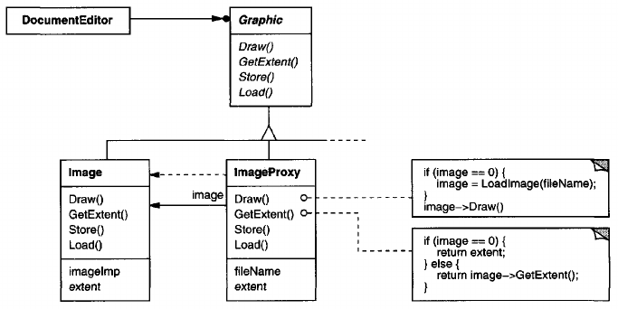
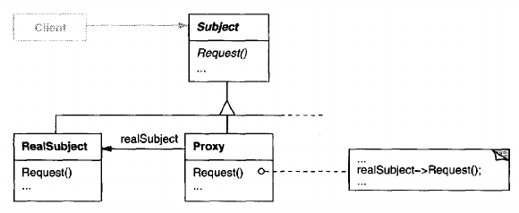

# Proxy

## Intent
Provide a surrogate or placeholder for another object to control access to it.

## Also Known As
Surrogate

## Motivation
One reason for controlling access to an object is to defer the full cost of its creation and initialization until we actually need to use it. Consider a document editor that can embed graphical objects in a document. Some graphical objects, like large raster images, can be expensive to create. But opening a document should be fast, so we should avoid creating all the expensive objects at once when the document is opened. This isn't necessary anyway, because not all of these objects will be visible in the document at the same time.

These constraints would suggest creating each expensive object *on demand*, which in this case occurs when an image becomes visible. But what do we put in the document in place of the image? And how can we hide the fact that the image is created on demand so that we don't complicate the editor's implementation? This optimization shouldn't impact the rendering and formatting code, for example.

The solution is to use another object, an image **proxy**, that acts as a stand-in for the real image. The proxy acts just like the image and takes care of instantiating it when it's required.


The image proxy creates the real image only when the document editor asks it to display itself by invoking its Draw operation. The proxy forwards subsequent requests directly to the image. It must therefore keep a reference to the image after creating it.

Let's assume that images are stored in separate files. In this case we can use the file name as the reference to the real object. The proxy also stores its **extent**, that is, its width and height. The extent lets the proxy respond to requests for its size from the formatter without actually instantiating the image.

The following class diagram illustrates this example in more detail.



The document editor accesses embedded images through the interface defined by the abstract Graphic class. ImageProxy is a class for images that are created on demand. ImageProxy maintains the file name as a reference to the image on disk. The file name is passed as an argument to the ImageProxy constructor.

ImageProxy also stores the bounding box of the image and a reference to the real Image instance. This reference won't be valid until the proxy instantiates the real image. The Draw operation makes sure the image is instantiated before forwarding it the request. GetExtent forwards the request to the image only if it's instantiated; otherwise ImageProxy returns the extent it stores.

## Applicability
Proxy is applicable whenever there is a need for a more versatile or sophisticated reference to an object than a simple pointer. Here are several common situations in which the Proxy pattern is applicable:
1. A **remote proxy** provides a local representative for an object in a different address space. NEXTSTEP uses the class NXProxy for this purpose. Coplien calls this kind of proxy an "Ambassador".
2. A **virtual proxy** creates expensive objects on demand. The ImageProxy described in the Motivation is an example of such a proxy.
3. A **protection proxy** controls access to the original object. Protection proxies are useful when objects should have difference access rights. For example, KernelProxies in the Choices operating system provide protected access to operating system objects.
4. A **smart reference** is a replacement for a bare pointer that performs additional actions when an object is accessed. Typical uses include:
    - counting the number of references to the real object so that it can be freed automatically when there are no more references (also called **smart pointers**).
    - loading a persistent object into memory when it's first referenced.
    - checking that the real object is locked before it's accessed to ensure that no other object can change it.

## Structure


Here's a possible object diagram of a proxy structure at run-time:


## Participants
- **Proxy** (ImageProxy)
    - maintains a reference that lets the proxy access the real subject. Proxy may refer to a Subject if the RealSubject and Subject interfaces are the same.
    - provides an interface identical to Subject's so that a proxy can be substituted for the real subject.
    - controls access to the real subject and may be responsible for creating and deleting it.
    - other responsibilities depend on the kind of proxy:
        - *remote proxies* are responsible for encoding a request and its arguments and for sending the encoded request to the real subject in a different address space.
        - *virtual proxies* may cache additional information about the real subject so that they can postpone accessing it. For example, the ImageProxy from the Motivation caches the real image's extent.
        - *protection proxies* check that the caller has the access permissions required to perform a request.
- **Subject** (Graphic)
    - defines the common interface for RealSubject and Proxy so that a Proxy can be used anywhere a RealSubject is expected.
- **RealSubject** (Image)
    -defines the real object that the proxy represents.

## Collaborations
- Proxy forwards requests to RealSubject when appropriate, depending on the kind of proxy.

## Consequences
The Proxy pattern introduces a level of indirection when accessing an object. The additional indirection has many uses, depending on the kind of proxy:
1. A remote proxy can hide the fact that an object resides in a different address space.
2. A virtual proxy can perform optimizations such as creating an object on demand.
3. Both protection proxies and smart references allow additional housekeeping tasks when an object is accessed.

There's another optimization that the Proxy pattern can hide from the client. It's called **copy-on-write**, and it's related to creation on demand. Copying a large and complicated object can be an expensive operation. If the copy is never modified, then there's no need to incur this cost. By using a proxy to postpone the copying process, we ensure that we pay the price of copying the object only if it's modified.

To make copy-on-write work, the subject must be reference counted. Copying the proxy will do nothing more than increment this reference count. Only when the client requests an operation that modifies the subject does the proxy actually copy it. In that case the proxy must also decrement the subject's reference count. When the reference count goes to zero, the subject gets deleted.

Copy-on-write can reduce the cost of copying heavyweight subjects significantly.

## Implementation
The Proxy pattern can exploit the following language features:
1. **Overloading the member access operator in C++.** C++ supports overloading ```operator->```, the member access operator. Overloading this operator lets you perform additional work whenever an object is dereferenced. This can be helpful for implementing some kinds of proxy; the proxy behaves just like a pointer.

    The following example illustrates how to use this technique to implement a virtual proxy called ```ImagePtr```.

        class Image;
        extern Image* LoadAnImageFile(const char*);
            // external function

        class ImagePtr {
        public:
            ImagePtr(const char* imageFile);
            virtual "ImagePtr();
            virtual Image* operator->();
            virtual Image& operator*();
        private:
            Image* LoadImage();
        private:
            Image * _image;
            const char* _imageFile;
        };

        ImagePtr::ImagePtr (const char* theImageFile) {
            _imageFile = theImageFile;
            _image = 0;
        }

        Image* ImagePtr::LoadImage () {
            if (_image = = 0 ) {
                _image = LoadAnImageFile(_imageFile);
            }
            return _image;
        }
    
    The overloaded -> and * operators use ```LoadImage``` to return ```_image``` to callers (loading it if necessary).

        Image* ImagePtr::operator-> () {
            return LoadImage();
        }
        Image& ImagePtr::operator* () {
            return *LoadImage();
        }
    
    This approach lets you call ```Image``` operations through ```ImagePtr``` objects without going to the trouble of making the operations part of the ```ImagePtr``` interface:

        ImagePtr image = ImagePtr("anImageFileName");
        image->Draw(Point(50, 100));
        // (image.operator->())->Draw(Point(50, 100))
    
    Notice how the ```image``` proxy acts like a pointer, but it's not declared to be a pointer to an ```Image```. That means you can't use it exactly like a real pointer to an ```Image```. Hence clients must treat ```Image``` and ```ImagePtr``` objects differently in this approach.

    Overloading the member access operator isn't a good solution for every kind of proxy. Some proxies need to know precisely *which* operation is called, and overloading the member access operator doesn't work in those cases.

    Consider the virtual proxy example in the Motivation. The image should be loaded at a specific time - namely when the Draw operation is called - and not whenever the image is referenced. Overloading the access operator doesn't allow this distinction. In that case we must manually implement each proxy operation that forwards the request to the subject. 

    These operations are usually very similar to each other. Typically all operations verify that the request is legal, that the original object exists, etc., before forwarding the request to the subject. It's tedious to write this code again and again. So it's common to use a preprocessor to generate it automatically.
2. **Using *doesNotUnderstand* in Smalltalk.** Smalltalk provides a hook that you can use to support automatic forwarding of requests. Smalltalk calls ```doesNotUnderstand: aMessage``` when a client sends a message to a receiver that has no corresponding method. The Proxy class can redefine ```doesNotUnderstand``` so that the message is forwarded to its subject.

    To ensure that a request is forwarded to the subject and not just absorbed by the proxy silently, you can define a Proxy class that doesn't understand *any* messages. Smalltalk lets you do this by defining Proxy as a class with no superclass.

    The main disadvantage of ```doesNotUnderstand:``` is that most Smalltalk systems have a few special messages that are handled directly by the virtual machine, and these do not cause the usual method look-up. The only one that's usually implemented in Object (and so can affect proxies) is the identity operation ==.

    If you're going to use ```doesNotUnderstand:``` to implement Proxy, then you must design around this problem. You can't expect identity on proxies to mean identity on their real subjects. An added disadvantage is that ```doesNotUnderstand:``` was developed for error handling, not for building proxies, and so it's generally not very fast.
3. **Proxy doesn't always have to know the type of real subject.** If a Proxy class can deal with its subject solely through an abstract interface, then there's no need to make a Proxy class for each RealSubject class; the proxy can deal with all RealSubject classes uniformly. But if Proxies are going to instantiate RealSubjects (such as in a virtual proxy), then they have to know the concrete class.

Another implementation issue involves how to refer to the subject before it's instantiated. Some proxies have to refer to their subject whether it's on disk or in memory. That means they must use some form of address space-independent object identifiers. We used a file name for this purpose in the Motivation.

## Related Patterns
[Adapter](<../2.2.1 Adapter/Adapter.md>): An adapter provides a different interface to the object it adapts. In contrast, a proxy provides the same interface as its subject. However, a proxy used for access protection might refuse to perform an operation that the subject will perform, so its interface may be effectively a subset of the subject's.

[Decorator](<../2.2.4 Decorator/Decorator.md>): Although decorators can have similar implementations as proxies, decorators have a different purpose. A decorator adds one or more responsibilities to an object, whereas a proxy controls access to an object.

Proxies vary in the degree to which they are implemented like a decorator. A protection proxy might be implemented exactly like a decorator. On the other hand, a remote proxy will not contain a direct reference to its real subject but only an indirect reference, such as "host ID and local address on host". A virtual proxy will start off with an indirect reference such as a file name but will eventually obtain and use a direct reference.
