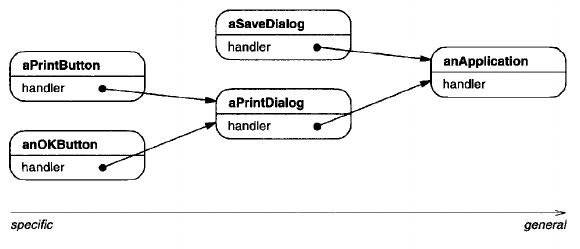
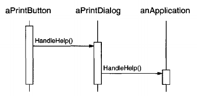
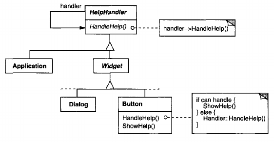
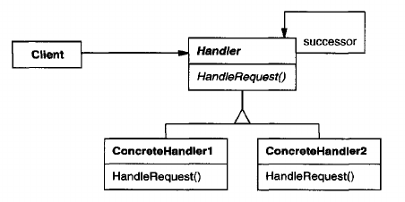
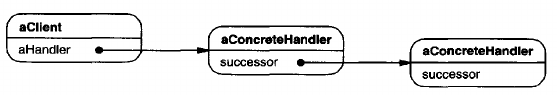

# Chain of Responsibility

## Intent
Avoid coupling the sender of a request to its receiver by giving more than one object a chance to handle the request. Chain the receiving objects and pass the request along the chain until an object handles it.

## Motivation
Consider a context-sensitive help facility for a graphical user interface. The user can obtain help information on any part of the interface just by clicking on it. The help that's provided depends on the part of the interface that's selected and its context; for example, a button widget in a dialog box might have different help information than a similar button in the main window. If no specific help information exists for that part of the interface, then the help system should display a more general help message about the immediate context - the dialog box as a whole, for example.

Hence it's natural to organize help information according to its generality - from the most specific to the most general. Furthermore, it's clear that a help request is handled by one of several user interface objects; which one depends on the context and how specific the available help is.

The problem here is that the object that ultimately *provides* the help isn't known explicitly to the object (e.g., the button) that *initiates* the help request. What we need is a way to decouple the button that initiates the help request from the objects that might provide help information. The Chain of Responsibility pattern defines how that happens.

The idea of this pattern is to decouple senders and receivers by giving multiple objects a chance to handle a request. The request gets passed along a chain of objects until one of them handles it.



The first object in the chain receives the request and either handles it or forwards it to the next candidate on the chain, which does likewise. The object that made the request has no explicit knowledge of who will handle it - we say the request has an **implicit receiver**.

Let's assume the user clicks for help on a button widget marked "Print". The button is contained in an instance of PrintDialog, which knows the application object it belongs to (see preceding object diagram). The following interaction diagram illustrates how the help request gets forwarded along the chain:



In this case, neither aPrintButton nor aPrintDialog handles the requests; it stops at anApplication, which can handle it or ignore it. The client that issued the request has no direct reference to the object that ultimately fulfills it. 

To forwards the request along the chain, and to ensure receivers remain implicit, each object on the chain shares a common interface for handling requests and for accessing its **successor** on the chain. For example, the help system might define a HelpHandler class with a corresponding HandleHelp operation. HelpHandler can be the parent class for candidate object classes, or it can be defined as a mixin class. Then classes that want to handle help requests can make HelpHandler a parent:



The Button, Dialog, and Application classes use HelpHandler operations to handle help requests. HelpHandler's HandleHelp operation forwards the request to the successor by default. Subclasses can override this operation to provide help under the right circumstances; otherwise they can use the default implementation to forwards the request.

## Applicability
Use Chain of Responsibility when
- more than one object may handle a request, and the handler isn't known *a priori*. The handler should be ascertained automatically. 
- you want to issue a request to one of several objects without specifying the receiver explicitly.
- the set of objects that can handle a request should be specified dynamically.

## Structure


A typical object structure might look like this:



## Participants
- **Handler** (HelpHandler)
    - defines an interface for handling requests.
    - (optional) implements the successor link.
- **ConcreteHandler** (PrintButton, PrintDialog)
    - handles requests it is responsible for.
    - can access its successor.
    - if the ConcreteHandler can handle the request, it does so; otherwise it forwards the request to its successor.
- **Client**
    - initiates the request to a ConcreteHandler object on the chain.

## Collaborations
- When a client issues a request, the request propagates along the chain until a ConcreteHandler object takes responsibility for handling it.

## Consequences
Chain of Responsibility has the following benefits and liabilities:
1. **Reduced coupling.** The pattern frees an object from knowing which other object handles a request. An object only has to know that a request will be handled "appropriately". Both the receiver and the sender have no explicit knowledge of each other, and an object in the chain doesn't have to know about the chain's structure.

    As a result, Chain of Responsibility can simplify object interconnections. Instead of objects maintaining references to all candidate receivers, they keep a single reference to their successor.
2. **Added flexibility in assigning responsibilities to objects.** Chain of Responsibility gives you added flexibility in distributing responsibilities among objects. You can add or change responsibilities for handling a request by adding to or otherwise changing the chain at run-time. You can combine this with sub-classing to specialize handlers statically.
3. **Receipt isn't guaranteed.** Since a request has no explicit receiver, there's no *guarantee* it'll be handled - the request can fall off the end of the chain without ever being handled. A request can also go unhandled when the chain is not configured properly.

## Implementation
Here are implementation issues to consider in Chain of Responsibility:
1. **Implementing the successor chain.** There are two possible ways to implement the successor chain:

    (a) Define new links (usually in the Handler, but ConcreteHandlers could define them instead).

    (b) Use existing links.

    Our examples so far define new links, but often you can use existing object references to form the successor chain. For example, parent references in a part-whole hierarchy can define a part's successor. A widget structure might already have such links. Composite discusses parent references in more detail.

    Using existing links works well when the links support the chain you need. It saves you from defining links explicitly, and it saves space. But if the structure doesn't reflect the chain of responsibility your application requires, then you'll have to define redundant links.
2. **Connecting successors.** If there are no preexisting references for defining a chain, then you'll have to introduce them yourself. In that case, the Handler not only defines the interface for the requests but usually maintains the successor as well. That lets the handler provide a default implementation of HandleRequest that forwards the request to the successor (if any). If a ConcreteHandler subclass isn't interested in the request, it doesn't have to override the forwarding operation, since its default implementation forwards unconditionally.

    Here's a HelpHandler base class that maintains a successor link:

        class HelpHandler {
            public:
                HelpHandler(HelpHandler* s) : _successor(s) { }
                virtual void HandleHelp();
            private:
                HelpHandler* _successor;
        };
        void HelpHandler::HandleHelp () {
            if (_successor) {
                _successor->HandleHelp();
            }
        }
3. **Representing requests.** Different options are available for representing requests.In the simplest form, the request is a hard-coded operation invocation, as in the case of HandleHelp. This is convenient and safe, but you can forward only the fixed set of requests that the Handler class defines.

    An alternative is to use a single handler function that takes a request code (e.g., an integer constant or a string) as parameter. This supports an open-ended set of requests. The only requirement is that the sender and receiver agree on how the request should be encoded.

    This approach is more flexible, but it requires conditional statements for dispatching the request based on its code. Moreover, there's no type-safe way to pass parameters, so they must be packed and unpacked manually. Obviously thi sis less safe than invoking an operation directly.

    To address the parameter-passing problem, we can use separate request *objects* that bundle request parameters. A ```Request``` class can represent requests explicitly, and new kinds of requests can be defined by sub-classing. Subclasses can define different parameters. Handlers must know the kind of request (that is, which ```Request``` subclass they're using) to access these parameters.

    To identify the request, ```Request``` can define an accessor function that returns an identifier for the class. Alternatively, the receiver can use run-time type information if the implementation languages supports it.

    Here is a sketch of a dispatch function that uses request objects to identify requests. A ```GetKind``` operation defined in the base ```Request``` class identifies the kind of request:

        void Handler::HandleRequest (Request* theRequest) {
            switch (theRequest->GetKind()) {
            case Help:
                // cast argument to appropriate type
                HandleHelp((HelpRequest*) theRequest);
                break;
            case Print:
                HandlePrint((PrintRequest*) theRequest);
                // . . .
                break;
            }
            default:
                // . . .
                break;
        }
    
    Subclasses can extend the dispatch by overriding ```HandleRequest```. The subclass handles only the requests in which it's interested; other requests are forwarded to the parent class. In this way, subclasses effectively extend (rather than override) the ```HandleRequest``` operation. For example, here's how an ```ExtendedHandler``` subclass extends ```Handler```'s version of ```HandleRequest```:

        class ExtendedHandler : public Handler {
            public:
            virtual void HandleRequest(Request* theRequest);
                // . . .
            };

        void ExtendedHandler::HandleRequest (Request* theRequest) {
            switch (theRequest->GetKind()) {
            case Preview:
                // handle the Preview request
                break;
            default:
                // let Handler handle other requests
                Handler::HandleRequest(theRequest);
            }
        }
4. **Automatic forwarding in Smalltalk.** You can use the ```doesNotUnderstand``` mechanism in Smalltalk to forward requests. Messages that have no corresponding methods are trapped in the implementation of ```doesNotUnderstand```, which can be overridden to forward the message to an object's successor. Thus it isn't necessary to implement forwarding manually; the class handles only the request in which it's interested, and it relies on ```doesNotUnderstand``` to forward all others.

## Related Patterns
Chain of Responsibility is often applied in conjunction with [Composite](<../../2.2 Structural Patterns/2.2.3 Composite/Composite.md>). There, a component's parent can act as its successor.