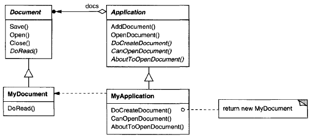

# Template Method

## Intent
Define the skeleton of an algorithm in an operation, deferring some steps to subclasses. Template Method lets subclasses redefine certain steps of an algorithm without changing the algorithm's structure.

## Motivation
Consider an application framework that provides Application and Document classes. The Application class is responsible for opening existing documents stored in an external format, such as a file. A Document object represents the information in a document once it's read from the file.

Applications build with the framework can subclass Application and Document to suit specific needs. For example, a drawing application defines DrawApplication and DrawDocument subclasses; a spreadsheet application defines SpreadsheetApplication and SpreadsheetDocument subclasses.



The abstract Application class defines the algorithm for opening and reading a document in its OpenDocument operation:

        void Application::OpenDocument (const char^ name) {
            if (!CanOpenDocument(name)) {
                // cannot handle this document
                return;
            }
            Document* doc = DoCreateDocument();

            if (doc) {
                _docs->AddDocument(doc);
                AboutToOpenDocument(doc);
                doc->Open();
                doc->DoRead();
            }
        }

OpenDocument defines each step for opening a document. It checks if the document can be opened, creates the application-specific Document object, adds it to its set of documents, and reads the Document from a file.

We call OpenDocument a **template method**. A template method defines an algorithm in terms of abstract operations that subclasses override to provide concrete behavior. Application subclasses define the steps of the algorithm that check if the document can be opened (CanOpenDocument) and that create the Document (DoCreateDocument). Document classes define the step that reads the document (DoRead). The template method also defines an operation that lets Application subclasses know when the document is about to be opened (AboutToOpenDocument), in case they care.

By defining some of the steps of an algorithm using abstract operations, the template method fixes their ordering, but it lets Application and Document subclasses vary those steps to suit their needs.

## Applicability
The Template Method pattern should be used
- to implement the invariant parts of an algorithm once and leave it up to subclasses to implement the behavior that can vary.
- when common behavior among subclasses should be factored and localized in a common class to avoid code duplication. This is a good example of "refactoring to generalize" as described by Opdyke and Johnson. You first identify the differences in the existing code and then separate the differences into new operations. Finally, you replace the differing code with a template method that calls one of these new operations.
- to control subclasses extensions. You can define a template method that calls "hook" operations (see Consequences) at specific points, thereby permitting extensions only at those points.

## Structure


## Participants
- **AbstractClass** (Application)
    - defines abstract **primitive operations** that concrete subclasses define to implement steps of an algorithm.
    - implements a template method defining the skeleton of an algorithm. The template method calls primitive operations as well as operations defined in AbstractClass or those of other objects.
- **ConcreteClass** (MyApplication)
    - implements the primitive operations to carry out subclass-specific steps of the algorithm.

## Collaborations
- ConcreteClass relies on AbstractClass to implement the invariant steps of the algorithm

## Consequences
Template methods are a fundamental technique for code reuse. They are particularly important in class libraries, because they are the means for factoring out common behavior in library classes.

Template methods lead to an inverted control structure that's sometimes referred to as "the Hollywood principle", that is, "Don't call us, we'll call you". This refers to how a parent class calls the operations of a subclass and not the other way around.

Template methods call the following kinds of operations:
- concrete operations (either on the ConcreteClass or on client classes);
- concrete AbstractClass operations (i.e., operations that are generally useful to subclasses);
- primitive operations (i.e., abstract operations);
- factory methods (see [Factory Method](<../../2.1 Creational Patterns/2.1.3 Factory Method/Factory Method.md>)); and
- **hook operations**, which provide default behavior that subclasses can extend if necessary. A hook operation often does nothing by default.

It's important for template methods to specify which operations are hooks (*may* be overridden) and which are abstract operations (*must* be overridden). To reuse an abstract class effectively, subclass writers must understand which operations are designed for overriding.

A subclass can *extend* a parent class operation's behavior by overriding the operation and calling the parent operation explicitly:

        void DerivedClass::Operation () {
            ParentClass::Operation();
            // DerivedClass extended behavior
        }

Unfortunately, it's easy to forget to call the inherited operation. We can transform such an operation into a template method to give the parent control over how subclasses extend it. The idea is to call a hook operation from a template method in the parent class. Then subclasses can then override this hook operation:

        void ParentClass::Operation () {
            // ParentClass behavior
            HookOperation();
        }

```HookOperation``` does nothing in ```ParentClass```:

        void ParentClass::HookOperation(){}

Subclasses override ```HookOperation``` to extend its behavior:

        void DerivedClass::HookOperation(){
            // derived class extension
        }

## Implementation
Three implementation issues are worth noting:
1. **Using C++ access control.** In C++, the primitive operations that a template method calls can be declared protected members. This ensures that they are only called by the template method. Primitive operations that *must* be overridden are declared pure virtual. The template method itself should not be overridden; therefore you can make the template method a nonvirtual member function.
2. **Minimizing primitive operations.** An important goal in designing template methods is to minimize the number of primitive operations that a subclass must override to flesh out the algorithm. The more operations that need overriding, the more tedious things get for clients.
3. **Naming conventions.** You can identify the operations that should be overridden by adding a prefix to their names. For example, the MacApp framework for Macintosh applications prefixes template method names with "Do-":"DoCreateDocument","DoRead", and so forth.

## Related Patterns
[Factory Methods](<../../2.1 Creational Patterns/2.1.3 Factory Method/Factory Method.md>) are often called by template methods. In the Motivation example, the factory method DoCreateDocument is called by the template method OpenDocument.

[Strategy](<../2.3.9 Strategy/Strategy.md>): Template methods use inheritance to vary part of an algorithm. Strategies use delegation to vary the entire algorithm.
