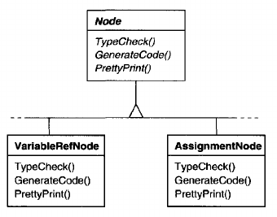
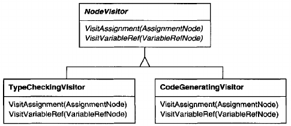
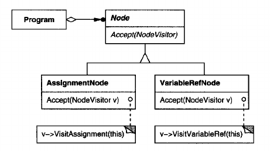
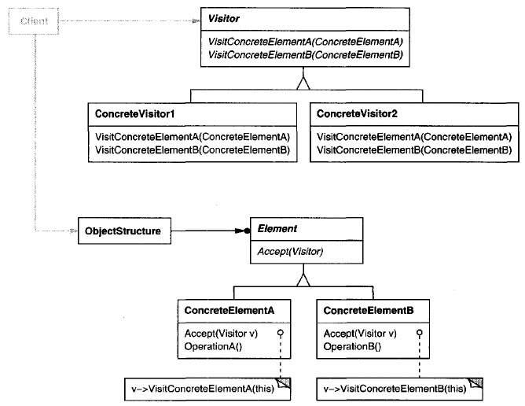
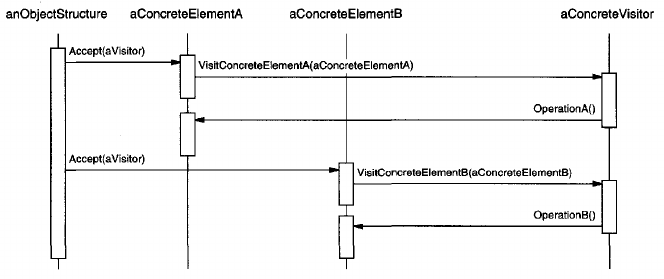

# Visitor

## Intent
Represent an operation to be performed on the elements of an object structure. Visitor lets you define a new operation without changing the classes of the elements on which it operates.

## Motivation
Consider a compiler that represents programs as abstract syntax trees. It will need to perform operations on abstract syntax trees for "static semantic" analyses like checking that all variables are defined. It will also need to generate code. So it might define operations for type-checking, code optimization, flow analysis, checking for variables being assigned values before they're used, and so on. Moreover we could use the abstract syntax trees for pretty-printing, program restructuring, code instrumentation, and computing various metrics of a program.

Most of these operations will need to treat nodes that represent assignment statements differently from nodes that represent variables or arithmetic expressions. Hence there will be one class for assignment statements, another for variable accesses, another for arithmetic expressions, and so on. The set of node classes depends on the language being compiled, of course, but it doesn't change much for a given language.



This diagram shows part of the Node class hierarchy. The problem here is that distributing all these operations across the various node classes leads to a system that's hard to understand, maintain, and change. It will be confusing to have type-checking code mixed with pretty-printing code or flow analysis code. Moreover, adding a new operation usually requires recompiling all of these classes. It would be better if each new operation could be added separately, and the node classes were independent of the operations that apply to them.

We can have both by packaging related operations from each class in separate object, called a **visitor**, and passing it to elements of the abstract syntax tree as it's traversed. When an element "accepts" the visitor, it sends a request to the visitor that encodes the element's class. It also includes the element as an argument. The visitor will then execute the operation for that element - the operation that used to be in the class of the element.

For example, a compiler that didn't use visitors might type-check a procedure by calling the TypeCheck operation on its abstract syntax tree. Each of the nodes would implement TypeCheck by calling TypeCheck on its components (see the preceding class diagram). If the compiler type-checked a procedure using visitors, then it would create a TypeCheckingVisitor object and call the Accept operation on the abstract syntax tree with that object as an argument. Each of the nodes would implement Accept by calling back on the visitor: an assignment node calls VisitAssignment operation on the visitor, while a variable reference calls VisitVariableReference. What used to be the TypeCheck operation in class AssignmentNode is now the VisitAssignment operation on TypeCheckingVisitor.

To make visitors work for more than just type-checking, we need an abstract parent class NodeVisitor for all visitors of an abstract syntax tree. NodeVisitor must declare an operation for each node class. An application that needs to compute program metrics will define new subclasses of NodeVisitor and will no longer need to add application-specific code to the node classes. The Visitor pattern encapsulates the operations for each compilation phase in a Visitor associated with that phase.






With the Visitor pattern, you define two class hierarchies: one for the elements being operated on (the Node hierarchy) and one for the visitors that define operations on the elements (the NodeVisitor hierarchy). You create a new operation by adding a new subclass to the visitor class hierarchy. As long as the grammar that the compiler accepts doesn't change (that is, we don't have to add new Node subclasses), we can add new functionality simply by defining new NodeVisitor subclasses.

## Applicability
Use the Visitor pattern when
- an object structure contains many classes of objects with differing interfaces, and you want to perform operations on these objects that depend on their concrete classes.
- many distinct and unrelated operations need to be performed on objects in an object structure, and you want to avoid "polluting" their classes with these operations. Visitor lets you keep related operations together by defining them in one class. When the object structure is shared by many applications, use Visitor to put operations in just those applications that need them.
- the classes defining the object structure rarely change, but you often want to define new operations over the structure. Changing the object structure classes requires redefining the interface to all visitors, which is potentially costly. If the object structure classes change often, then it's probably better to define the operations in those classes.

## Structure


## Participants
- **Visitor** (NodeVisitor)
    - declares a Visit operation for each class of ConcreteElement in the object structure. The operation's name and signature identifies the class that sends the Visit request to the visitor. That lets the visitor determine the concrete class of the element being visited. Then the visitor can access the element directly through its particular interface.
- **ConcreteVisitor** (TypeCheckingVisitor)
    - implements each operation declared by Visitor. Each operation implements a fragment of the algorithm defined for the corresponding class of object in the structure. ConcreteVisitor provides the context for the algorithm and stores its local state. This state often accumulates results during the traversal of the structure.
- **Element** (Node)
    - defines an Accept operation that takes a visitor  as an argument.
- **ConcreteElement** (AssignmentNode, VariableRefNode)
    - implements an Accept operation that takes a visitor as an argument
- **ObjectStructure** (Program)
    - can enumerate its elements.
    - may provide a high-level interface to allow the visitor to visit its elements.
    - may either be a composite (see [Composite](<../../2.2 Structural Patterns/2.2.3 Composite/Composite.md>)) or a collection such as a list or a set.

## Collaborations
- A client that uses the Visitor pattern must create a ConcreteVisitor object and then traverse the object structure, visiting each element with the visitor.
- When an element is visited, it calls the Visitor operation that corresponds to its class. The element supplies itself as an argument to this operation to let the visitor access its state, if necessary.

    The following interaction diagram illustrates the collaborations between an object structure, a visitor, and two elements:

    

## Consequences
Some of the benefits and liabilities of the Visitor pattern are as follows:
1. **Visitor makes adding new operations easy.** Visitors make it easy to add operations that depend on the components of complex objects. You can define a new operation over an object structure simply by adding a new visitor. In contrast, if you spread functionality over many classes, then you must change each class to define a new operation.
2. **A visitor gathers related operations and separates unrelated ones.** Related behavior isn't spread over the classes defining the object structure; it's localized in a visitor. Unrelated sets of behavior are partitioned in their own visitor subclasses. That simplifies both the classes defining the elements and the algorithms defined in the visitors. Any algorithm-specific data structures can be hidden in the visitor.
3. **Adding new ConcreteElement classes is hard.** The Visitor pattern makes it hard to add new subclasses of Element. Each new ConcreteElement gives rise to a new abstract operation on Visitor and a corresponding implementation in every ConcreteVisitor class. Sometimes a default implementation can be provided in Visitor that can be inherited by most of the ConcreteVisitors, but this is the exception rather than the rule.

    So they key consideration in applying the Visitor pattern is whether you are mostly likely to change the algorithm applied over an object structure or the classes of objects that make up the structure. The Visitor class hierarchy can be difficult to maintain when new ConcreteElement classes are added frequently. In such cases, it's probably easier just to define operations on the classes that make up the structure. If the Element class hierarchy is stable, but you are continually adding operations or changing algorithms, then the Visitor pattern will help you manage the changes.
4. **Visiting across class hierarchies.** An iterator (see [Iterator](<../2.3.4 Iterator/Iterator.md>)) can visit the objects in a structure as it traverses them by calling their operations. But an iterator can't work across object structures with different types of elements. Visitor does not have this restriction. It can visit objects that don't have a common parent class. You can add any type of object to a Visitor interface.
5. **Accumulating state.** Visitors can accumulate state as they visit each element in the object structure. Without a visitor, this state would be passed as extra arguments to the operations that perform the traversal, or they might appear as global variables.
6. **Breaking encapsulation.** Visitor's approach assumes that the ConcreteElement interface is powerful enough to let visitors do their job. As a result, the pattern often forces you to provide public operations that access an element's internal state, which may compromise its encapsulation.

## Implementation
Each object structure will have an associated Visitor class. This abstract visitor class declares a VisitConcreteElement operation for each class of ConcreteElement defining the object structure. Each Visit operation on the Visitor declares its argument to be a particular ConcreteElement, allowing the Visitor to access the interface of the ConcreteElement directly. ConcreteVisitor classes override each Visit operation to implement visitor-specific behavior for the corresponding ConcreteElement class.

The Visitor class would be declared like this in C++:

        class Visitor {
        public:
            virtual void VisitElementA(ElementA*);
            virtual void VisitElementB(ElementB*);
            // and so on for other concrete elements
        protected:
            Visitor();
        };

Each class of ConcreteElement implements an ```Accept``` operation that calls the matching ```Visit...``` operation on the visitor for that ConcreteElement. Thus the operation that ends up getting called depends on both the class of the element and the class of the visitor.

The concrete elements are declared as

        class Element {
        public:
            virtual ~Element();
            virtual void Accept(Visitors) = 0;
        protected:
            Element();
        };

        class ElementA : public Element {
        public:
            ElementA();
            virtual void Accept(Visitor& v) { v.VisitElementA(this); }
        };

        class Elements : public Element {
        public:
            Elements();
            virtual void Accept(Visitors v) { v.VisitElementB(this); }
        };

A ```CompositeElement``` class might implement ```Accept``` like this:

        class CompositeElement : public Element {
        public:
            virtual void Accept(Visitor&);
        private:
            List<Element.*>* _children;
        };

        void CompositeElement::Accept (Visitor& v) {
            ListIterator<Element*> i(_children);

            for (i.First(); !i.IsDone() ; i.Next()) {
                i.CurrentItem()->Accept(v);
            }
            v.VisitCompositeElement(this);
        }

Here are two other implementation issues that arise when you apply the Visitor pattern:
1. **Double dispatch.** Effectively, the Visitor pattern lets you add operations to classes without changing them. Visitor achieves this by using a technique called **double-dispatch**. It's well-known technique. In fact, some programming languages support it directly (CLOS, for example). Languages like C++ and Smalltalk support **single-dispatch**.

    In single-dispatch languages, two criteria determine which operation will fulfill a request: the name of the request and the type of receiver. For example, the operation that a GenerateCode request will call depends on the type of node object you ask. In C++, calling ```GenerateCode``` on an instance of ```VariableRefNode``` will call ```VariableRefNode::GenerateCode``` (which generates code for a variable reference). Calling ```GenerateCode``` on an ```AssignmentNode``` will call ```AssignmentNode::GenerateCode``` (which will generate code for an assignment). The operation that gets executed depends both on the kind of request and the type of the receiver.

    "Double-dispatch" simply means the operation that gets executed depends on the kind of request and the types of *two* receivers. ```Accept``` is a double-dispatch operation. Its meaning depends on two types: the Visitor's and the Element's. Double-dispatching lets visitors request different operations on each class of element.

    This is the key to the Visitor pattern: The operation that gets executed depends on both the type of Visitor and the type of Element it visits. Instead of binding operations statically into the Element interface, you can consolidate the operations in a Visitor and use ```Accept``` to do the binding at run-time. Extending the Element interface amounts to defining one new Visitor subclass rather than many new Element subclasses.
2. **Who is responsible for traversing the object structure?** A visitor must visit each element of the object structure. The question is, how does it get there? We can put responsibility for traversal in any of three places: in the object structure, in the visitor, or in a separate iterator object (see [Iterator](<../2.3.4 Iterator/Iterator.md>)).

    Often the object structure is responsible for iteration. A collection will simple iterate over its elements, calling the Accept operation on each. A composite will commonly traverse itself by having each Accept operation traverse the element's children and call Accept on each of them recursively.

    Another solution is to use an iterator to visit the elements. In C++, you could use either an internal or external iterator, depending on what is available and what is most efficient. In Smalltalk, you usually use an internal iterator using ```do:`` and a block. Since internal iterators are implemented by the object structure, using an internal iterator is a lot like making the object structure responsible for iteration. The main difference is that an internal iterator will not cause double-dispatching - it will call an operation on the *visitor* with an *element* as an argument as opposed to calling an operation on the *element* with the *visitor* as an argument. But it's easy to use the Visitor pattern with an internal iterator if the operation on the visitor simply calls the operation on the element without recursing.

    You could even put the traversal algorithm in the visitor, although you'll end up duplicating the traversal code in each ConcreteVisitor for each aggregate ConcreteElement. The main reason to put the traversal strategy in the visitor is to implement a particularly complex traversal, one that depends on the results of the operations on the object structure.

## Related Patterns
[Composite](<../../2.2 Structural Patterns/2.2.3 Composite/Composite.md>): Visitors can be used to apply an operation over an object structure defined by the Composite pattern.

[Interpreter](<../2.3.3 Interpreter/Interpreter.md>): Visitor may be applied to the interpretation.


