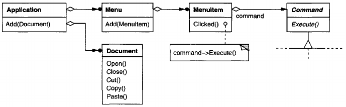
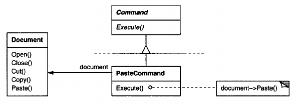
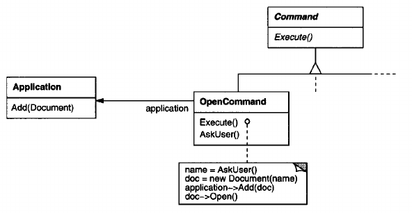
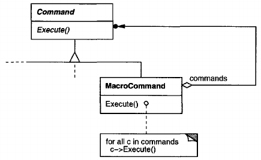
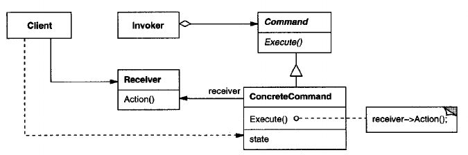
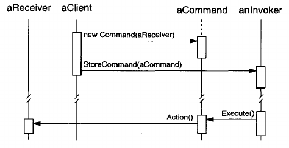

# Command

## Intent
Encapsulate a request as an object, thereby letting you parameterize clients with different requests, queue or log requests, and support undoable operations.

## Also Known As
Action, Transaction

## Motivation
Sometimes it's necessary to issue requests to objects without knowing anything about the operation being requested or the receiver of the request. For example, user interface toolkits include objects like buttons and menus that carry out a request in response to user input. But the toolkit can't implement the request explicitly in the button or menu, because only applications that use the toolkit know what should be done on which object. As toolkit designers we have no way of knowing the receiver of the request or the operations that will carry it out.

The Command pattern lets toolkit objects make requests of unspecified application objects by turning the request itself into an object. This object can be stored and passed around like other objects. The key to this pattern is an abstract Command class, which declares an interface for executing operations. In the simplest form this interface includes an abstract Execute operation. Concrete Command subclasses specify a receiver-action pair by storing the receiver as an instance variable and by implementing Execute to invoke the request. The receiver has the knowledge required to carry out the request.

Menus can be implemented easily with Command objects. Each choice in a Menu is an instance of a MenuItem class. An Application class creates these menus and their menu items along with the rest of the user interface. The Application class also keeps track of Document objects that a user has opened.

The application configures each MenuItem with an instance of a concrete Command subclass. When the user selects a MenuItem, the MenuItem calls Execute on its command, and Execute carries out the operation. MenuItems don't know which subclass of Command they use. Command subclasses store the receiver of the request and invoke one or more operations on the receiver.

For example, PasteCommand supports pasting text from the clipboard into a Document. PasteCommand's receiver is the Document object it is supplied upon instantiation. The Execute operation invokes Paste on the receiving Document.

OpenCommand's Execute operation is different: it prompts the user for a document name, creates a corresponding Document object, adds the document to the receiving application, and opens the document.

Sometimes a MenuItem needs to execute a *sequence* of commands. For example, a MenuItem for centering a page at normal size could be constructed from a CenterDocumentCommand object and a NormalSizeCommand object. Because it's common to string commands together in this way, we can define a MacroCommand class to allow a MenuItem to execute an open-ended number of commands.

MacroCommand is a concrete Command subclass that simply executes a sequence of Commands. MacroCommand has no explicit receiver, because the commands it sequences define their own receiver.

In each of these examples, notice how the Command pattern decouples the object that invokes the operation from the one having the knowledge to perform it. This gives us a lot of flexibility in designing our user interface. An application can provide both a menu and a push button interface to a feature just by making the menu and the push button share an instance of the same concrete Command subclass. We can replace commands dynamically, which would be useful for implementing context-sensitive menus. We can also support command scripting by composing commands into larger ones. All of this is possible because the object that issues a request only needs to know how to issue it; it doesn't need to know how the request will be carried out.

## Applicability
Use the Command pattern when you want to
- parameterize objects by an action to perform, as MenuItem objects did above. You can express such parameterization in a procedural language with a **callback** function, that is, a function that's registered somewhere to be called at a later point. Commands are an object-oriented replacement for callbacks.
- specify, queue, and execute requests at different times. A Command object can have a lifetime independent of the original request. If the receiver of a request can be represented in an address space-independent way, then you can transfer a command object for the request to a different process and fulfill the request there. 
- support undo. The Command's Execute operation can store state for reversing its effects in the command itself. The Command interface must have an added Unexecute operation that reverses the effects of a previous call to Execute. EXecuted commands are stored in a history list. Unlimited-level undo and redo is achieved by traversing this list backwards and forwards calling Unexecute and Execute, respectively.
- support logging changes so that they can be reapplied in case of a system crash. By augmenting the Command interface with load and store operations, you can keep a persistent log of changes. Recovering from a crash involves reloading logged commands from disk and reexecuting them with the execute operation.
- structure a system around high-level operations built on primitives operations. Such a structure is common in information systems that support **transactions**. A transaction encapsulates a set of changes to data. The Command pattern offers a way to model transactions. Commands have a common interface, letting you invoke all transactions the same way. The pattern also makes it easy to extend the system with new transactions.

## Structure

## Participants
- **Command**
    - declares an interface for executing an operation.
- **ConcreteCommand** (PasteCommand, OpenCommand)
    - defines a binding between a Receiver object and an action.
    - implements Execute by invoking the corresponding operation(s) on Receiver.
- **Client** (Application)
    - creates a ConcreteCommand object and sets its receiver.
- **Invoker** (MenuItem)
    - asks the command to carry out the request.
- **Receiver** (Document, Application)
    - knows how to perform the operations associated with carrying out a request. Any class may serve as a Receiver.

## Collaborations
- The client creates a ConcreteCommand object and specifies its receiver.
- An Invoker object stores the ConcreteCommand object.
- The invoker issues a request by calling Execute on the command. When commands are undoable, ConcreteCommand stores state for undoing the command prior to invoking Execute.
- The ConcreteCommand object invokes operations on its receiver to carry out the request.

The following diagram shows the interactions between these objects. It illustrates how Command decouples the invoker from the receiver (and the request it carries out).

## Consequences
The Command pattern has the following consequences:
1. Command decouples the object that invokes the operation from the one that knows how to perform it.
2. Commands are first-class objects. They can be manipulated and extended like any other object.
3. You can assemble commands into a composite command. An example is the MacroCommand class described earlier. In general, composite commands are an instance of the Composite pattern.
4. It's easy to add new Commands, because you don't have to change existing classes.

## Implementation
Consider the following issues when implementing the Command pattern:
1. **How intelligent should a command be?** A command can have a wide range of abilities. At one extreme it merely defines a binding between a receiver and the actions that carry out the request. At the other extreme it implements everything itself without delegating to a receiver at all. The latter extreme is useful when you want to define commands that are independent of existing classes, when no suitable receiver exists, or when a command knows its receiver implicitly. For example, a command that creates another application window may be just as capable of creating the window as any other object. Somewhere in between these extremes are commands that have enough knowledge to find their receiver dynamically.
2. **Supporting undo and redo.** Commands can support undo and redo capabilities if they provide a way to reverse their execution (e.g., an Unexecute or Undo operation). A ConcreteCommand class might need to store additional state to do so. This state can include
    - the Receiver object, which actually carries out operations in response to the request,
    - the arguments to the operation performed on the receiver, and
    - any original values in the receiver that can change as a result of handling the request. The receiver must provide operations tht let the command return the receiver to its prior state.

To support one level of undo, an application needs to store only the command that was executed last. For multiple-level undo and redo, the application needs a **history list** of commands that have been executed, where the maximum length of the list determines the number of undo / redo levels. The history list stores sequences of commands that have been executed. Traversing backward through the list and reverse-executing commands cancels their effect; traversing forward and executing commands reexecutes them.

An undoable command might have to be copied before it can be placed on the history list. That's because the command object that carried out the original request, say, from a MenuItem, will perform other requests at later times. Copying is required to distinguish different invocations of the same command if its state can vary across invocations.

For example, a DeleteCommand that deletes selected objects must store different sets of objects each time it's executed. Therefore the DeleteCommand object must be copied following execution, and the copy is placed on the history list. If the command's state never changes on execution, then copying is not required - only a reference to the command need be placed on the history list. Commands that must be copied before being placed on the history list act as prototypes.
3. **Avoiding error accumulation in the undo process.** Hysteresis can be a problem in ensuring a reliable, semantics-preserving undo / redo mechanism. Errors can accumulate as commands are executed, unexecuted, and reexecuted repeatedly so that an application's state eventually diverges from original values. It may be necessary therefore to store more information in the command to ensure that objects are restored to their original state. The Memento pattern can be applied to give the command access to this information without exposing the internals of other objects.
4. **Using C++ templated.** For commands that (1) aren't undoable and (2) don't require arguments, we can use C++ templates to avoid creating a Command subclass for every kind of action and receiver.

## Related patterns
A [Composite](<../../2.2 Structural Patterns/2.2.3 Composite/Composite.md>) can be used to implement MacroCommands.

A [Memento](<../2.3.6 Memento/Memento.md>) can keep state the command requires to undo its effect.

A command that must be copied before being places on the history list acts as a [Prototype](<../../2.1 Creational Patterns/2.1.4 Prototype/Prototype.md>).

