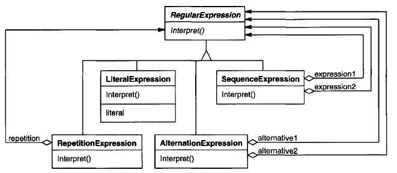
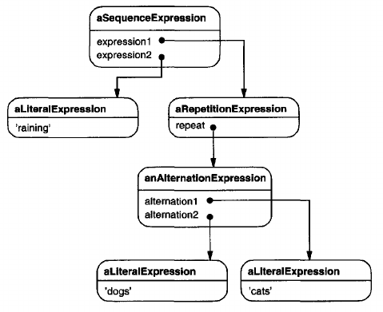
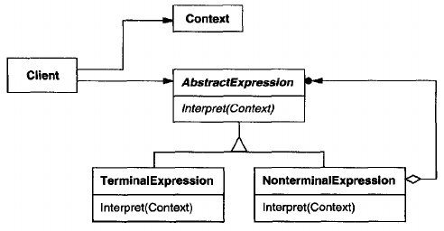

# Interpreter

## Intent
Given a language, define a representation for its grammar along with an interpreter that uses the representation to interpret sentences in the language.

## Motivation
If a particular kind of problem occurs often enough, then it might be worthwhile to express instances of the problem as sentences in a simple language. Then you can build an interpreter that solves the problem by interpreting these sentences.

For example, searching for strings that match a pattern is a common problem. Regular expressions are a standard language for specifying patterns of strings. Rather than building custom algorithms to match each pattern against strings, search algorithm could interpret a regular expression that specifies a set of strings to match.

The Interpreter pattern describes how to define a grammar for simple languages, represent sentences in the language, and interpret these sentences. In this example, the pattern describes how to define a grammar for regular expressions, represent a particular regular expression, and how to interpret that regular expression.

Suppose the following grammar defines the regular expressions:

        expression ::= literal | alternation | sequence | repetition | '(' expression ')'
        alternation ::- expression '|' expression
        sequence ::- expression '&' expression
        repetition ::= expression '*'
        literal ::- 'a' \ 'b' | 'c' | ... { 'a' | 'b' | 'c' | ... }*

The symbol *expression* is the start symbol, and *literal* is a terminal symbol defining simple words.

The Interpreter pattern uses a class to represent each grammar rule. Symbols on the right-hand side of the rule are instance variables of these classes. The grammar above is represented by five classes: an abstract class RegularExpression and its four subclasses LiteralExpression, AlternationExpression, SequenceExpression, and RepetitionExpression. The last three classes define variables that hold sub-expressions.

Every regular expression defined by this grammar is represented by an abstract syntax tree made up of instances of these classes. For example, the abstract syntax tree

represents the regular expression

        raining & (dogs | cats) *

We can  create an interpreter for these regular expressions by defining the Interpret operation on each subclass of RegularExpression. Interpret takes as an argument the context in which to interpret the expression. The context contains the input string and information on how much of it has been matched so far. Each subclass of RegularExpression implements Interpret to match the next part of the input string based on the current context. For example,

- LiteralExpression will check if the input matches the literal it defines,
- AlternationExpression will check if the input matches any of its alternatives,
- RepetitionExpression will check if the input has multiple copies of expression it repeats,

and so on.

## Applicability
Use the Interpreter pattern when there is a language to interpret, and you can represent statements in the language as abstract syntax trees. The Interpreter pattern works best when

- the grammar is simple. For complex grammars, the class hierarchy for the grammar becomes large and unmanageable. Tools such as parser generators are a better alternative in such cases. They can interpret expressions without building abstract syntax trees, which can save space and possibly time.
- efficiency is not a critical concern. The most efficient interpreters are usually *not* implemented by interpreting parse trees directly but by first translating them into another form. For example, regular expressions are often transformed into state machines. But even then, the *translator* can be implemented by the Interpreter pattern, so the pattern is still applicable.

## Structure

## Participants
- **AbstractExpression** (RegularExpression)
    - declares an abstract Interpret operation that is common to all nodes in the abstract syntax tree.
- **TerminalExpression** (LiteralExpression)
    - implements an Interpret operation associated with terminal symbols in the grammar.
    - an instance is required for every terminal symbol in a sentence.
- **NonterminalExpression** (AlternationExpression, RepetitionExpression, SequenceExpressions)
    - one such class is required for every rule  R ::= R1 R2 . . . Rn in the grammar.
    - maintains instance variables of type AbstractExpression for each of the symbols R1 through Rn.
    - implements an Interpret operation for nonterminal symbols in the grammar. Interpret typically calls itself recursively on the variables representing R1 through Rn.
- **Context**
    - contains information that's global to the interpreter.
- **Client**
    - builds (or is given) an abstract syntax tree representing a particular sentence in the language that the grammar defines. The abstract syntax tree is assembled from instances of the NonterminalExpression and TerminalExpression classes.
    - invokes the Interpret operation.

## Collaborations
- The client builds (or is given) the sentence as an abstract syntax tree of NonterminalExpression and TerminalExpression instances. Then the client initializes the context and invokes the Interpret operation.
- Each NonterminalExpression node defines Interpret in terms of Interpret on each subexpression. The Interpret operation of each TerminalExpression defines the base case in the recursion.
- The Interpret operations at each node use the context to store and access the state of the interpreter.

## Consequences
The Interpreter pattern has the following benefits and liabilities:
1. **It's easy to change and extend the grammar.** Because the pattern uses classes to represent grammar rules, you can use inheritance to change or extend the grammar. Existing expressions can be modified incrementally, and new expressions can be defined as variations on old ones.
2. **Implementing the grammar is easy, too.** Classes defining nodes in the abstract syntax tree have similar implementations. These classes are easy to write, and often their generation can be automated with a compiler or parser generator.
3. **Complex grammars are hard to maintain.** The Interpreter pattern defines at least one class for every rule in the grammar (grammar rules defined BNF may require multiple classes). Hence grammars containing many rules can be hard to manage and maintain. Other design patterns can be applied to mitigate the problem (see Implementation). But when the grammar is very complex, other techniques such as parser or compiler generators are more appropriate.
4. **Adding new ways to interpret expressions.** The Interpreter pattern makes it easier to evaluate an expression in a new way. For example, you can support pretty printing or type-checking an expression by defining a new operation on the expression classes. If you keep creating new ways of interpreting an expression, then consider using the Visitor pattern to avoid changing the grammar classes.

## Implementation
The Interpreter and Composite patterns share many implementation issues. The following issues are specific to Interpreter:
1. **Creating the abstract syntax tree.** The Interpreter pattern doesn't explain how to *create* an abstract syntax tree. In other words, it doesn't address parsing. The abstract syntax tree can be created by a table-driven parser, by a hand-crafted (usually recursive descent) parser, or directly by the client.
2. **Defining the Interpret operation.** You don't have to define the Interpret operation in the expression classes. If it's common to create a new interpreter, then it's better to use the Visitor pattern to put Interpret in a separate "visitor" object. For example, a grammar for a programming language will have many operations on abstract syntax trees, such as a type-checking, optimization, code generation, and so on. It will be more likely to use a visitor to avoid defining these operations on every grammar class.
3. **Sharing terminal symbols with the Flyweight pattern.** Grammars whose sentences contain many occurrences of a terminal symbol might benefit from sharing a single copy of that symbol. Grammars for computer programs are good examples - each program variable will appear in many places throughout the code. In the Motivation example, a sentence can have the terminal symbol *dog* (modeled by the LiteralExpression class) appearing many times.

    Terminal nodes generally don't store information about their position in the abstract syntax tree. Parent nodes pass them whatever context they need during interpretation. Hence there is a distinction between shared (intrinsic) state and passed-in (extrinsic) state, and the Flyweight pattern applies.

    For example, each instance of LiteralExpression for *dog* receives a context containing the substring matched so far. And every such LiteralExpression does the same thing in its Interpret operation - it checks whether the next part of the input contains a *dog* - no matter where the instance appears in the tree.

## Related Patterns
[Composite](<../../2.2 Structural Patterns/2.2.3 Composite/Composite.md>): The abstract syntax tree is an instance of the Composite pattern.

[Flyweight](<../../2.2 Structural Patterns/2.2.6 Flyweight/Flyweight.md>) shows how to share terminal symbols within the abstract syntax tree.

[Iterator](<../2.3.4 Iterator/Iterator.md>): The interpreter can use an Iterator to traverse the structure.

[Visitor](<../2.3.11 Visitor/Visitor.md>) can be used to maintain the behavior in each node in the abstract syntax tree in one class.
