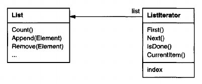
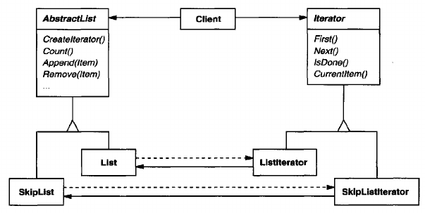
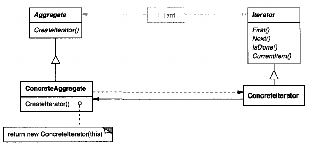

# Iterator

## Intent
Provide a way to access the elements of an aggregate object sequentially without exposing its underlying representation.

## Also Known As
Cursor

## Motivation
An aggregate object such as a list should give you a way to access its elements without exposing its internal structure. Moreover, you might want to traverse the list in different ways, depending on what you want to accomplish. But you probably don't want to bloat the List interface with operations for different traversals, even if you could anticipate the ones you will need. You might also need to have more than one traversal pending on the same list.

The Iterator pattern lets you do all this. The key idea in this pattern is to take the responsibility for access and traversal out of the list object and put it into an **iterator** object. The Iterator class defines an interface for accessing the list's elements. An iterator object is responsible for keeping track of the current element; that is, it knows which elements have been traversed already.

For example, a List class would call for a ListIterator with the following relationship between them:

Before you can instantiate ListIterator, you must supply the List to traverse. Once you have the ListIterator instance, you can access the list's elements sequentially. The CurrentItem operation returns the current element in the list, First initializes the current element to the first element, Next advances the current element to the next element, and IsDone tests whether we've advanced beyond the last element - that is, we're finished with the traversal.

Separating the traversal mechanism from the List object lets us define iterators for different traversal policies without enumerating them in the List interface. For example, FilteringListIterator might provide access only to those elements that satisfy specific filtering constraints.

Notice that the iterator and the list are coupled, and the client must know that it is a *list* that's traversed as opposed to some other aggregate structure. Hence, the client commits to a particular aggregate structure. It would be better if we could change the aggregate class without changing client code. We can do this by generalizing the iterator concept to support **polymorphic iteration**.

As an example, let's assume that we also have a SKipList implementation of a list. A skiplist is a probabilistic data structure with characteristics similar to balanced trees. We want to be able to write code that works for both List and SkipList objects.

We define an AbstractList class that provides a common interface for manipulating lists. Similarly, we need an abstract Iterator class that defines a common iteration interface. Then we can define concrete Iterator subclasses for the different list implementations. As a result, the iteration mechanism becomes independent of concrete aggregate classes.

The remaining problem is how to create the iterator. Since we want to write code that's independent of the concrete List subclasses, we cannot simply instantiate a specific class. Instead, we make the list objects responsible for creating their corresponding iterator. This requires an operation like CreateIterator through which clients request an iterator object.

CreateIterator is an example of a factory method (see Factory Method). We use it here to let a client ask a list object for the appropriate iterator. The Factory Method approach give rise to two class hierarchies, one for lists and another for iterators. The CreateIterator factory method "connects" the two hierarchies.

## Applicability
Use the Iterator pattern
- to access an aggregate object's contents without exposing its internal representation.
- to support multiple traversals of aggregate objects.
- to provide a uniform interface for traversing different aggregate structures (that is, to support polymorphic iterations).

## Structure

## Participants
- **Iterator**
    - defines an interface for accessing and traversing elements.
- **ConcreteIterator**
    - implements the Iterator interface.
    - keeps track of the current position in the traversal of the aggregate.
- **Aggregate**
    - defines an interface for creating an Iterator object.
- **ConcreteAggregate**
    - implements the Iterator creation interface to return an instance of the proper ConcreteIterator.

## Collaborations
- A ConcreteIterator keeps track of the current object in the aggregate and can compute the succeeding object in the traversal.

## Consequences
The Iterator pattern has three important consequences:

1. **It supports variations in the traversal of an aggregate.** Complex aggregates may be traversed in many ways. For example, code generation and semantic checking involve traversing parse trees. Code generation may traverse the parse tree inorder or preorder. Iterators make it easy to change the traversal algorithm: Just replace the iterator instance with a different one. You can also define Iterator subclasses to support new traversals.
2. **Iterators simplify the Aggregate interface.** Iterator's traversal interface obviates the need for a similar interface in Aggregate, thereby simplifying the aggregate's interface.
3. **More than one traversal can be pending on an aggregate.** An iterator keeps track of its own traversal state. Therefore you can have more than one traversal in progress at once.

## Implementation
Iterator has many implementation variants and alternatives. Some important ones follow. The trade-offs often depend on the control structures your language provides. Some languages (CLU, for example) even support this pattern directly.

1. **Who controls the iteration?** A fundamental issue is deciding which party controls the iteration, the iterator or the client that uses the iterator. When the client controls the iteration, the iterator is called an **external iterator / active iterator**, and when the iterator controls it, the iterator is an **internal iterator / passive iterator**. Clients that use an external iterator must advance the traversal and request the next element explicitly from the iterator. In contrast, the client hands an internal iterator an operation to perform, and the iterator applies that operation to every element in the aggregate.

    External iterators are more flexible than internal iterators. It's easy to compare two collections for equality with an external iterator, for example, but it's practically impossible with internal iterators. Internal iterators are especially weak in a language like C++ that does not provide anonymous functions, closures, or continuations like Smalltalk and CLOs. But on the other hand, internal iterators are easier to use, because they define the iteration logic for you.
2. **Who defines the traversal algorithm?** The iterator is not the only place where the traversal algorithm can be defined. The aggregate might define the traversal algorithm and use the iterator to store just the state of the iteration. We call this kind of iterator a **cursor**, since it merely points to the current position in the aggregate. A client will invoke the Next operation on the aggregate with the cursor as an argument, and the Next operation will change the state of the cursor.

    If the iterator is responsible for the traversal algorithm, then it's easy to use different iteration algorithms on the same aggregate, and it can also be easier to reuse the same algorithm on different aggregates. On the other hand, the traversal algorithm might need to access the private variables of the aggregate. If so, putting the traversal algorithm in the iterator violates the encapsulation of the aggregate.
3. **How robust is the iterator?** It can be dangerous to modify an aggregate while you're traversing it. If elements are added or deleted from the aggregate, you might end up accessing an element twice or missing it completely. A simple solution is to copy the aggregate and traverse the copy, but that's too expensive to do in general.

    A **robust iterator** ensures that insertions and removals won't interfere with traversal, and it does it without copying the aggregate. There are many ways to implement robust iterators. Most rely on registering the iterator with the aggregate. On insertion or removal, the aggregate either adjusts the internal state of iterators it has produced, or it maintains information internally to ensure proper traversal.

    Kofler provides a good discussion of how robust iterators are implemented in ET++. Murray discusses the implementation of robust iterators for the USL StandardComponents' List class.
4. **Additional Iterator operations.** The minimal interface to Iterator consists of the operations First, Next, IsDone, and CurrentItem. Some additional operations might prove useful. For example, ordered aggregates can have a Previous operation that positions the iterator to the previous element. A SkipTo operation is useful for sorted or indexed collections. SkipTo positions the iterator to an object matching specific criteria.
5. **Using polymorphic iterators in C++.** Polymorphic iterators have their cost. They require the iterator object to be allocated dynamically by a factory method. Hence they should be used only when there's a need for polymorphism. Otherwise use concrete iterators, which can be allocated on the stack.

    Polymorphic iterators have another drawback: the client is responsible for deleting them. This is error-prone, because it's easy to forget to free a heap-allocated iterator object when you're finished with it. That's especially likely when there are multiple exit points in an operation. And if an exception is triggered, the iterator object will never be freed.

    The Proxy pattern provides a remedy. We can use a stack-allocated proxy as a stand-in for the real iterator. The proxy deletes the iterator in its destructor. Thus when the proxy goes out of scope, the real iterator will get de-allocated along with it. The proxy ensures proper cleanup, even in the face of exceptions. This is an application of the well-known C++ technique "resource allocation is initialization".
6. **Iterators may have privileged access.** An iterator can be viewed as an extension of the aggregate that created it. The iterator and the aggregate are tightly coupled. We can express this close relationship in C++ by making the iterator a **friend** of its aggregate. Then you don't need to define aggregate operations whose sole purpose is to let iterators implement traversal efficiently.

    However, such privileged access can make defining new traversals difficult, since it'll require changing the aggregate interface to add another friend. To avoid this problem, the Iterator class can include **protected** operations for accessing important but publicly unavailable members of the aggregate. Iterator subclasses (and *only* Iterator subclasses) may use these protected operations to gain privileged access to the aggregate.
7. **Iterators for composited.** External iterators can be difficult to implement over recursive aggregate structures like those in the Composite pattern, because a position in the structure may span many levels of nested aggregates. Therefore an external iterator has to store a path through the Composite to keep track of the current object. Sometimes it's easier just to use an internal iterator. It can record the current position simply by calling itself recursively, thereby storing the path implicitly in the call stack.

    If the nodes in a Composite have an interface for moving from a node to its siblings, parents, and children, then a cursor-based iterator may offer a better alternative. The cursor only needs to keep track of the current node; it can rely on the node interface to traverse the Composite.

    Composites often need to be traversed in more than one way. Preorder, postorder, inorder, and breadth-first traversals are common. You can support each kind of traversal with a different class of iterator.
8. **Null iterators.** A **NullIterator** is a degenerate iterator that's helpful for handling boundary conditions. By definition, a NullIterator is *always* done with traversal; that is, its IsDone operation always evaluates to true.

    NullIterator can make traversing tree-structured aggregates (like Composites) easier. At each point in the traversal, we ask the current element for an iterator for its children. Aggregate elements return a concrete iterator as usual. But leaf elements return an instance of NullIterator. That lets us implement traversal over the entire structure is a uniform way.

## Related Patterns
[Composite](<../../2.2 Structural Patterns/2.2.3 Composite/Composite.md>): Iterators are often applied  to recursive structures such as Composites.

[Factory Method](<../../2.1 Creational Patterns/2.1.3 Factory Method/Factory Method.md>): Polymorphic iterators rely on factory methods to instantiate the appropriate Iterator subclass.

[Memento](<../2.3.6 Memento/Memento.md>) is often used in conjunction with the Iterator pattern. An iterator can use a memento to capture the state of an iteration. The iterator stores the memento internally.
