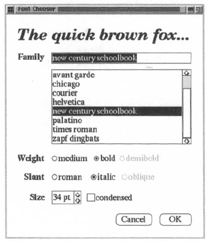
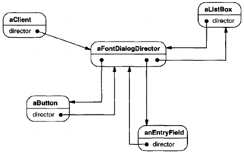
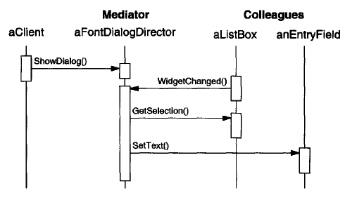
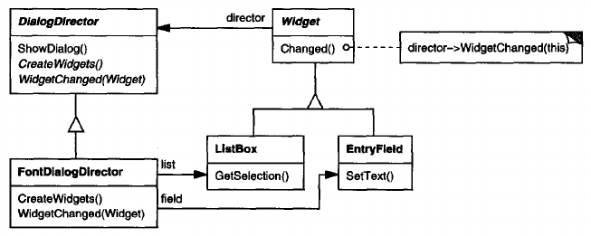
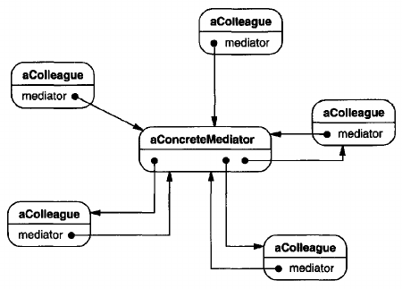

# Mediator

## Intent
Define an object that encapsulates how a set of objects interact. Mediator promotes loose coupling by keeping objects from referring to each other explicitly, and it lets you vary their interaction independently.

## Motivation
Object-oriented design encourages the distribution of behavior among objects. Such distribution can result in an object structure with many connections between objects; in the worst case, every object ends up knowing about every other.

Though partitioning a system into many objects generally enhances reusability, proliferating interconnections tend to reduce it again. Lots of interconnections make it less likely that an object can work without the support of others - the system acts as though it were monolithic. Moreover, it can be difficult to change the system's behavior in any significant way, since behavior is distributed among many objects. As a result, you may be forced to define many subclasses to customize the system's behavior.

As an example, consider the implementation of dialog boxes in a graphical user interface. A dialog box uses a window to present a collection of widgets such as buttons, menus, and entry fields, as shown here:

Often there are dependencies between the widgets in the dialog. For example, a button gets disabled when a certain entry field is empty. Selecting an entry in a list of choices called a **list box** might change the contents of an entry field. Conversely, typing text into the entry field might automatically select one or more corresponding entries in the list box. Once text appears in the entry field, other buttons may become enabled that let the user do something with the text, such as changing or deleting the thing to which it refers.

Different dialog boxes will have different dependencies between widgets. So even though dialogs display the same kinds of widgets, they can't simply reuse stock widget classes; they have to be customized to reflect dialog-specific dependencies. Customizing them individually by subclassing will be tedious, since many classes are involved.

You can avoid these problems by encapsulating collective behavior in a separate **mediator** object. a mediator is responsible for controlling and coordinating the interactions of a group of objects. The mediator serves as an intermediary that keeps objects in the group from referring to each other explicitly. The objects only know the mediator, thereby reducing the number of interconnections.

For example, **FontDialogDirector** can be the mediator between the widgets in a dialog box. A FontDialogDirector object knows the widgets in a dialog and coordinates their interaction. It acts as a hub of communication for widgets:

The following interaction diagram illustrates how the objects cooperate to handle a change in a list box's selection:

Here's the succession of events by which a list box's selection passes to an entry field:

1. The list box tells its director that it's changed.
2. The director gets the selection from the list box.
3. The director passes the selection to the entry field.
4. Now that the entry field contains some text, the director enables button(s) for initiating an action (e.g., "semibold", "oblique").

Note how the director mediates between the list box and the entry field. Widgets communicate with each other only indirectly, through the director. They don't have to know about each other; all they know is the director. Furthermore, because the behavior is localized in one class, it can be changed or replaced by extending or replacing that class.

Here's how the FontDialogDirector abstraction can be integrated into a class library:

DialogDirector is an abstract class that defines the overall behavior of a dialog. Clients call the ShowDialog operation to display the dialog on the screen. CreateWidgets is an abstract operation for creating the widgets of a dialog. WidgetChanged is another abstract operation; widgets call it to inform their director that they have changed. DialogDirector subclasses override CreateWidgets to create the proper widgets, and they override WidgetChanged to handle the changes.

## Applicability
Use the Mediator pattern when

- a set of objects communicate in well-defined but complex ways. The resulting interdependencies are unstructured and difficult to understand.
- reusing an object is difficult because it refers to and communicates with many other objects.
- a behavior that's distributed between several classes should be customizable without a lot of subclassing.

## Structure

A typical object structure might look like this:

## Participants
- **Mediator** (DialogDirector)
    - defines an interface for communicating with Colleague objects.
- **ConcreteMediator** (FontDialogDirector)
    - implements cooperative behavior by coordinating Colleague objects.
    - knows and maintains its colleagues.
- **Colleague classes** (ListBox, EntryField)
    - each Colleague class knows its Mediator object.
    - each colleague communicates with its mediator whenever it would have otherwise communicated with another colleague.

## Collaborations
- Colleagues send and receive requests from a Mediator object. The mediator implements the cooperative behavior by routing requests between the appropriate colleague(s).

## Consequences
The Mediator pattern has the following benefits and drawbacks:
1. **It limits subclassing.** A mediator localizes behavior that otherwise would be distributed among several objects. Changing this behavior requires subclassing Mediator only; Colleague classes can be reused as is.
2. **It decouples colleagues.** A mediator promotes loose coupling between colleagues. You can vary and reuse Colleague and Mediator classes independently.
3. **It simplifies object protocols.** A mediator replaces many-to-many interactions with one-to-many interactions between the mediator and its colleagues. One-to-many relationships are easier to understand, maintain, and extend.
4. **It abstracts how objects cooperate.** Making mediation an independent concept and encapsulating it in an object lets you focus on how objects interact apart from their individual behavior. That can help clarify how objects interact in a system.
5. **It centralizes control.** The Mediator pattern trades complexity of interaction for complexity in the mediator. Because a mediator encapsulates protocols, it can become more complex than any individual colleague. This can make the mediator itself a monolith that's hard to maintain.

## Implementation
The following implementation issues are relevant to the Mediator pattern:
1. **Omitting the abstract Mediator class.** There's no need to define an abstract Mediator class when colleagues work with only one mediator. The abstract coupling that the Mediator class provides lets colleagues work with different Mediator subclasses, and vice versa.
2. **Colleague-Mediator communication.** Colleagues have to communicate with their mediator when an event of interest occurs. One approach is to implement the Mediator as an Observer using the Observer pattern. Colleague classes act as Subjects, sending notifications to the mediator whenever they change state. The mediator responds by propagating the effects of the change to other colleagues.

    Another approach defines a specialized notification interface in Mediator that lets colleagues be more direct in their communication. Smalltalk/V for Windows uses a form of delegation: When communicating with the mediator, a colleague passes itself as an argument, allowing the mediator to identify the sender.

## Related Patterns
[Facade](<../../2.2 Structural Patterns/2.2.5 Facade/Facade.md>) differs from Mediator in that it abstracts a subsystem of objects to provide a more convenient interface. Its protocol is unidirectional; that is, Facade objects make requests of the subsystem classes but not vice versa. In contrast, Mediator enables cooperative behavior that colleague objects don't or can't provide, and the protocol is multidirectional.

Colleagues can communicate with the mediator using the [Observer](<../2.3.7 Observer/Observer.md>) pattern.