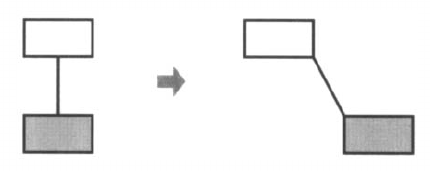
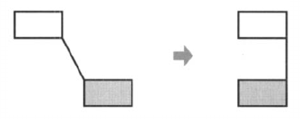
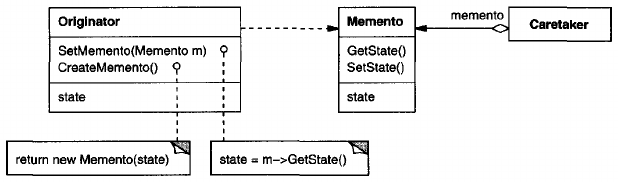
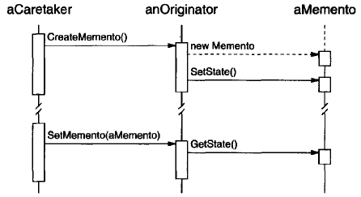

# Memento

## Intent
Without violating encapsulation, capture and externalize an object's internal state so that the object can be restored to this state later.

## Also Known As
Token

## Motivation
Sometimes it's necessary to record the internal state of an object. This is required when implementing checkpoints and undo mechanisms that let users back out of tentative operations or recover from errors. You must save state information somewhere so that you can restore objects to their previous states. But objects normally encapsulate some or all of their state, making it inaccessible to other objects and impossible to save externally. Exposing this state would violate encapsulation, which can compromise the application's reliability and extensibility.

Consider for example a graphical editor that supports connectivity between objects. A user can connect two rectangles with a line, and the rectangles stay connected when the user moves either of them. The editor ensures that the line stretches to maintain the connection.

A well-known way to maintain connectivity relationships between objects is with a constraint-solving system. We can encapsulate this functionality in a **ConstraintSolver** object. ConstraintSolver records connections as they are made and generates mathematical equations that describe them. It solves these equations whenever the user makes a connection or otherwise modifies the diagram. ConstraintSolver uses the results of its calculations to rearrange the graphics so that they maintain the proper connections.

Supporting undo in this application isn't as easy as it may seem. An obvious way to undo a move operation is to store the original distance moved and move the object back an equivalent distance. However, this does not guarantee all objects will appear where they did before. Suppose there is some slack in the connection. In that case, simply moving the rectangle back to its original location won't necessarily achieve the desired effect.

In general, the ConstraintSolver's public interface might be insufficient to allow precise reversal of its effect on other objects. The undo mechanism must work more closely with constraintSolver to reestablish previous state, but we should also avoid exposing the ConstraintSolver's internals to the undo mechanism.

We can solve this problem with the Memento pattern. A **memento** is an object that stores a snapshot of the internal state of another object - the memento's **originator**. The undo mechanism will request a memento from the originator when it needs to checkpoint the originator's state. The originator initializes the memento with information that characterizes its current state. Only the originator can store and retrieve information from the memento - the memento is "opaque" to other object.

In the graphical editor example just discussed, the ConstraintSolver can act as an originator. The following sequence of events characterizes the undo process:
1. The editor requests a memento from the ConstraintSolver as a side-effect of move operation.
2. The ConstraintSolver creates and returns a memento, an instance of a class SolverState in this case. A SolverState memento contains data structures that describe the current state of the ConstraintSolver's internal equations and variables.
3. Later when the user undoes the move operation, the editor gives the SolverState back to the ConstraintSolver.
4. Based on the information in the SolverState, the ConstraintSolver changes its internal structures to return its equations and variables to their exact previous state.

This arrangement lets the ConstraintSolver entrust other objects with the information it needs to revert to a previous state without exposing its internal structure and representations.

## Applicability
Use the Memento pattern when
- a snapshot of (some portion of) an object's state must be saved so that it can be restored to that state later, *and*
- a direct interface to obtaining the state would expose implementation details and break the object's encapsulation.

## Structure

## Participants
- **Memento** (SolverState)
    - stores internal state of the Originator object. The memento may store as much or as little of the originator's internal state as necessary as its originator's discretion.
    - protects against access by objects other than the originator. Mementos have effectively two interfaces. Caretaker sees a *narrow* interface to the Memento - it can only pass the memento to other objects. Originator, in contrast, sees a *wide* interface, one that lets it access all the data necessary to restore itself to its previous state. Ideally, only the originator that produced the memento would be permitted to access the memento's internal state.
- **Originator** (ConstraintSolver)
    - creates a memento containing a snapshot of its current internal state.
    - uses the memento to restore its internal state.
- **Caretaker** (undo mechanism)
    - is responsible for the memento's safekeeping.
    - never operates on or examines the contents of a memento.

## Collaborations
- A caretaker requests a memento from an originator, holds it for a time, and passes it back to the originator, as the following interaction diagram illustrates:
    

    Sometimes the caretaker won't pass the memento back to the originator, because the originator might never need to revert to an earlier state.
- Mementos are passive. Only the originator that created a memento will assign or retrieve its state.

## Consequences
The Memento pattern has several consequences:
1. **Preserving encapsulation boundaries.** Memento avoids exposing information that only an originator should manage but that must be stored nevertheless outside the originator. The pattern shields other objects from potentially complex Originator internals, thereby preserving encapsulation boundaries.
2. **It simplifies Originator.** In other encapsulation-preserving design, Originator keeps the versions of internal state that clients have requested. That puts all the storage management burden on Originator. Having clients manage the state they ask for simplifies Originator and keeps clients from having to notify originators when they're done.
3. **Using mementos might be expensive.** Mementos might incur considerable overhead if Originator must copy large amounts of information to store in the memento or if clients create and return mementos to the originator often enough. Unless encapsulating and restoring Originator state is cheap, the pattern might not be appropriate. See the discussion of incrementality in the Implementation section.
4. **Defining narrow and wide interfaces.** It maybe difficult in some languages to ensure that only the originator can access the memento's state.
5. **Hidden costs in caring for mementos.** A caretaker is responsible for deleting the mementos it cares for. However, the caretaker has no idea how much state is in the memento. Hence and otherwise lightweight caretaker might incur large storage costs when it stores mementos.

## Implementation
Here are two issues to consider when implementing the Memento pattern:
1. **Language support.** Mementos have two interfaces: a wide one for originators and a narrow one for other objects. Ideally the implementation language will support two levels of static protection. C++ lets you do this by making the Originator a friend of Memento and making Memento's wide interface private. Only the narrow interface should be declared public. For example:

        class State;

        class Originator {
        public:
            Memento* CreateMemento();
            void SetMemento(const Memento*);
            // . . .
        private:
            State* _state;
            // internal data structures
            // . . .
        };
        class Memento {
        public:
            // narrow public interface
            virtual ~Memento();
        private:
            // private members accessible only to Originator
            friend class Originator;
            Memento();
            void SetState(State*);
            State* GetStateO ;
            // . . .
        private:
            State* _state;
            // . - .
        };
2. **Storing incremental changes.** When mementos get created and passed back to their originator in a predictable sequence, then Memento can save just the *incremental change* to the originator's internal state.

    For example, undoable commands in a history list can use mementos to ensure that commands are restored to their exact state when they're undone (see [Command](<../2.3.2 Command/Command.md>)). The history list defines a specific order in which commands can be undone and redone. That means mementos can store just the incremental change that a command makes rather than the full state of every object they affect. In the Motivation example given earlier, the constraint solver can store only those internal structures that change to keep the line connecting the rectangles, as opposed to storing the absolute positions of these objects.

## Related Patterns
[Command](<../2.3.2 Command/Command.md>): Commands can use mementos to maintain state for undoable operations.

[Iterator](<../2.3.4 Iterator/Iterator.md>): Mementos can be used for iteration as described earlier.
