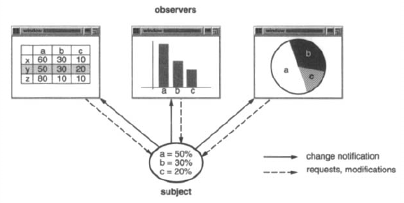
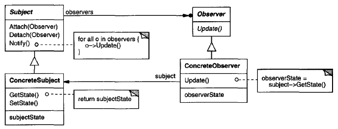
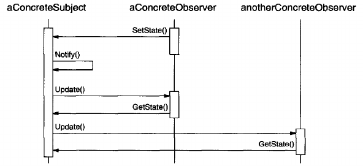
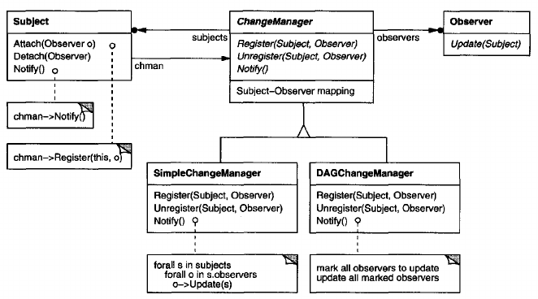

# Observer

## Intent
Define a one-to-many dependency between objects so that when one object changes state, all its dependents are notified and updated automatically.

## Also Known As
Dependents, Publish-Subscribe

## Motivation
A common side-effect of partitioning a system into a collection of cooperating classes is the need to maintain consistency between related objects. You don't want to achieve consistency by making the classes tightly coupled, because that reduces their reusability.

For example, many graphical user interface toolkits separate the presentational aspects of the user interface from the underlying application data. Classes defining application data and presentations can be reused independently. They can work together, too. Both a spreadsheet object and bar chart object can depict information in the same application data object using different presentations. The spreadsheet and the bar chart don't know about each other, thereby letting you reuse only the one you need. But they *behave* as though they do. When the user changes the information in the spreadsheet, the bar chart reflects the changes immediately, and vice versa.



This behavior implies that the spreadsheet and bar chart are dependent on the data object and therefore should be notified of any change in its state. And there's no reason to limit the number of dependent objects to two; there may be any number of different user interfaces to the same data.

The Observer pattern describes how to establish these relationships. The key objects in this pattern are **subject** and **observer**. A subject may have any number of dependent observers. All observers are notified whenever the subject undergoes a change in state. In response, each observer will query the subject to synchronize its state with the subject's state.

This king of interaction is also known as **publish-subscribe**. The subject is the publisher of notifications. It sends out these notifications without having to know who its observers are. Any number of observers can subscribe to receive notifications.

## Applicability
Use the Observer pattern in any of the following situations:
- When an abstraction has two aspects, one dependent on the other. Encapsulating these aspects in separate objects lets you vary and reuse them independently.
- When a change to one object requires changing others, and you don't know how many objects need to be changed.
- When an object should be able to notify other objects without making assumptions about who these objects are. In other words, you don't want these objects tightly coupled.

## Structure


## Participants
- **Subject**
    - knows its observers. Any number of Observer objects may observe a subject.
    - provides an interface for attaching and detaching Observer objects.
- **Observer**
    - defines an updating interface for objects that should be notified of changes in a subject.
- **ConcreteSubject**
    - stores state of interest to ConcreteObserver objects.
    - sends a notification to its observers when its state changes.
- **ConcreteObserver**
    - maintains a reference to a ConcreteSubject object.
    - stores state that should stay consistent with the subject's.
    - implements the Observer updating interface to keep its state consistent with the subject's.

## Collaborations
- ConcreteSubject notifies its observers whenever a change occurs that could make its observers' state inconsistent with its own.
- After being informed of a change in the concrete subject, a ConcreteObserver object may query the subject for information. ConcreteObserver uses this information to reconcile its state with that of the subject.

    The following interaction diagram illustrates the collaborations between a subject and two observers:

    

    Note how the Observer object that initiates the change request postpones its update until it gets a notification from the subject. Notify is not always called by the subject. It can be called by an observer or by another kind of object entirely. The Implementation section discusses some common variations.

## Consequences
The Observer pattern lets you vary subjects and observers independently. You can reuse subjects without reusing their observers, and vice versa. It lets you add observers without modifying the subject or other observers.

Further benefits and liabilities of the Observer pattern include the following:
1. **Abstract coupling between Subject and Observer.** All a subject knows is that it has a list of observers, each conforming to the simple interface of the abstract Observer class. The subject doesn't know the concrete class of any observers. Thus the coupling between subjects and observers is abstract and minimal.

    Because Subject and Observer aren't tightly coupled, they can belong to different layers of abstraction in a system. A lower-level subject can communicate and inform a higher-level observer, thereby keeping the system's layering intact. If Subject and Observer are lumped together, then the resulting object must either span two layers (and violate the layering), or it must be forced to live in one layer or the other (which might compromise the layering abstraction).
2. **Support for broadcast communication.** Unlike an ordinary request, the notification that a subject sends needn't specify its receiver. The notification is broadcast automatically to all interested objects that subscribed to it. The subject doesn't care how many interested objects exists; its only responsibility it to notify its observers. This gives you the freedom ao add and remove observers at any time. It's up to the observer to handle or ignore a notification.
3. **Unexpected updates.** Because observers have no knowledge of each other's presence, they can be blind to the ultimate cost of changing the subject. A seemingly innocuous operation on the subject may cause a cascade of updates to observers and their dependent objects. Moreover, dependency criteria that aren't well-defined or maintained usually lead to spurious updates, which can be hard to track down.

    This problem is aggravated by the fact that the simple update protocol provides no details on *what* changed in the subject. Without additional protocol to help observers discover what changed, they may be forced to work hard to deduce the changes.

## Implementation
Several issues related to the implementation of the dependency mechanism are discussed in this section.
1. **Mapping subjects to their observers.** The simplest way for a subject to keep track of the observers it should notify is to store references to them explicitly in the subject. However, such storage may be too expensive when there are many subjects and few observers. One solution is to trade space for time by using an associative look-up (e.g., a hash table) to maintain the subject-to-observer mapping. Thus a subject with no observers does not incur storage overhead. On the other hand, this approach increases the cost of accessing the observers.
2. **Observing more than one subject.** It might make sense in some situations for an observer to depend on more than one subject. For example, a spreadsheet may depend on more than one data source. It's necessary to extend the Update interface in such cases to let the observer know *which* subject is sending the notification. The subject can simply pass itself as a parameter in the Update operation, thereby letting the observer known which subject to examine.
3. **Who triggers the update?** The subject and its observers rely on the notification mechanism to stay consistent. But what object actually calls Notify to trigger the update? Here are two options:
    
    (a) Have state-setting operations on Subject call Notify after they change the subject's state. The advantage of this approach is that clients don't have to remember to call Notify on the subject. This disadvantage is that several consecutive operations will cause several consecutive updates, which may be inefficient.

    (b) Make clients responsible for calling Notify at the right time. The advantage here is that the client can wait to trigger the update until after a series of state changes has been make, thereby avoiding needless intermediate updates. The disadvantage is that clients have an added responsibility to trigger the update. That makes errors more likely, since clients might forget to call Notify.
4. **Dangling references to deleted subjects.** Deleting a subject should not produce dangling references in its observers. One way to avoid dangling references is to make the subject notify its observers as it is deleted so that they can reset their reference to it. In general, simply deleting the observers is not an option, because other objects may reference them, or  they may be observing other subjects as well.
5. **Making sure Subject state is self-consistent before notification.** It's important to make sue Subject state is self-consistent before calling Notify, because observers query the subject for its current sate in the course of updating their own state.

    This self-consistency rule is easy to violate unintentionally when Subject subclass operations call inherited operations. For example, the notification in the following code sequence is triggered when the subject is in an inconsistent state:

        void MySubject::Operation (int newValue) {
            BaseClassSubject::Operation(newValue);
            // trigger notification

            _my!nstVar += newValue;
            // update subclass state (too late!)
        }
    
    You can avoid this pitfall by sending notifications from template methods (Template Method) in abstract Subject classes. Define a primitive operation for subclasses to override, and make Notify the last operation in the template method, which will ensure that the object is self-consistent when subclasses override Subject operations.

        void Text::Cut (TextRange r) {
            ReplaceRange(r);
            // redefined in subclasses
            Notify();
        }
    
    By the way, it's always a good idea to document which Subject operations trigger notifications.
6. **Avoiding observer-specific update protocols: the push and pull models.** Implementations of the Observer pattern often have the subject broadcast additional information about the change. The subject passes this information as an argument to Update. The amount of information may vary widely.

    At one extreme, which we call the **push model**, the subject sends observers detailed information about the change, whether they want it or not. At the other extreme is the **pull model**; the subject sends nothing but the most minimal notification, and observers ask for details explicitly thereafter.

    The pull model emphasizes the subject' ignorance of its observers, whereas the push model assumes subjects known something about their observers' needs. The push model might make observers less reusable, because Subject classes make assumptions about Observer classes that might not always be true. On the other hand, the pull model may be inefficient, because Observer classes must ascertain what changed without help from the Subject.
7. **Specifying modifications of interest explicitly.** You can improve update efficiency by extending the subject's registration interface to allow registering observers only for specific events of interest. When such an event occurs, the subject informs only those observers that have registered interest in that event. One way to support this uses the notion of **aspects** for Subject objects. To register interest in particular events, observers are attached to their subjects using

        void Subject::Attach(Observer*, Aspects interest);
    
    where ```interest``` specifies the event of interest. At notification time, the subject supplies the changed aspect to its observers as a parameter to the Update operation. For example:

        void Observer::Update(Subject*, Aspect& interest);
8. **Encapsulating complex update semantics.** When the dependency relationship between subjects and observers is particularly complex, an object that maintains these relationships might be required. We call such an object a **ChangeManager**. Its purpose is to minimize the work required to make observers reflect a change in their subject. For example, it an operation involves changes to several interdependent subjects, you might have to ensure that their observers are notified only after *all* the subjects have been modified to avoid notifying observers more than once.

    ChangeManager has three responsibilities:

    (a) It maps a subject to its observers and provides an interface to maintain this mapping. This eliminates the need for subjects to maintain references to their observers and vice versa.

    (b) It defines a particular update strategy.

    (c) It updates all dependent observers at the request of a subject.

    The following diagram depicts a simple ChangeManager-based implementation of the Observer pattern. There are two specialized ChangeManagers. SimpleChangeManager is naive in that it always updates all observers of each subject. In contrast, DAGChangeManager handles directed-acyclic graphs of dependencies between subject and their observers. A DAGChangeManager is preferable to a SimpleChangeManager when an observer observes more than one subject. In that case, a change in two or more subjects might cause redundant updates. The DAGChangeManager ensures the observer receives just one update. SimpleChangeManager is fine when multiple updates aren't an issue.

    

    ChangeManager is an instance of the Mediator pattern. In general there is only one ChangeManager, and it is known globally. The Singleton pattern would be useful here.
9. **Combining the Subject and Observer classes.** Class libraries written in languages that lack multiple inheritance (like Smalltalk) generally don't  define separate Subject and Observer classes but combine their interfaces in one class. That lets you define an object that acts as both a subject and an observer without multiple inheritance. In Smalltalk, for example, the Subject and Observer interfaces are defined in the root class Object, making them available to all classes.

## Related Patterns
[Mediator](<../2.3.5 Mediator/Mediator.md>): By encapsulating complex update semantics, the ChangeManager acts as a mediator between subjects and observers.

[Singleton](<../../2.1 Creational Patterns/2.1.5 Singleton/Singleton.md>): The ChangeManager may use the Singleton pattern to make it unique and globally accessible.
