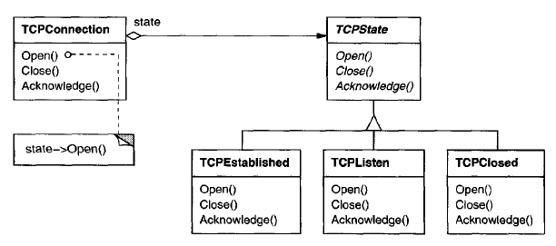
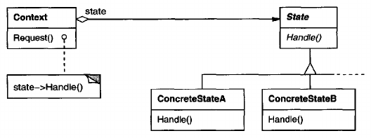

# State

## Intent
Allow an object to alter its behavior when its internal state changes. The object will appear to change its class.

## Also Known As
Objects for States

## Motivation
Consider a class TCPConnection that represents a network connection. A TCPConnection object can be in one of several different states: Established, Listening, Closed. When a TCPConnection object receives requests from other objects, it responds differently depending on its current state. For example, the effect on an Open request depends on whether the connection is in its Closed state or its Established state. The State pattern describes how TCPConnection can exhibit different behavior in each state.

The key idea in this pattern is to introduce an abstract class called TCPState to represent the states of the network connection. The TCPState class declares an interface common to all classes that represent different operational states. Subclasses of TCPState implement state-specific behavior. For example, the classes TCPEstablished and TCPClosed implement behavior particular to the Established and cLosed states of TCPConnection.



The class TCPConnection maintains a state object (an instance of a subclass of TCPState) that represents the current state of the TCP connection. The class TCPConnection delegates all state-specific requests to this state object. TCPConnection uses its TCPState subclass instance to perform operations particular to the state of the connection

Whenever the connection changes state, the TCPConnection object changes the state object it uses. When the connection goes from established to closed, for example, TCPConnection will replace its TCPEstablished instance with a TCPClosed instance.

## Applicability
Use the State pattern in either of the following cases:
- An object's behavior depends on its state, and it must change its behavior at run-time depending on that state.
- Operations have large, multipart conditional statements tht depend on the object's state. This state is usually represented by one or more enumerated constants. Often, several operations will contain this same conditional structure. The State pattern puts each branch of the conditional in a separate class. This lets you treat the object's state as an object in its own right that can vary independently from other objects.

## Structure


## Participants
- **Context** (TCPConnection)
    - defines the interface of interest to clients.
    - maintains an instance of a ConcreteState subclass that defines the current state.
- **State** (TCPState)
    - defines an interface for encapsulating the behavior associated with a particular state of the Context.
- **ConcreteState subclasses** (TCPEstablished, TCPListen, TCPClosed)
    - each subclass implements a behavior associated with a state of the Context.

## Collaborations
- Context delegates state-specific requests to the current ConcreteState object.
- A context may pass itself as an argument to the State object handling the request. This lets the State object access the context if necessary.
- Context is the primary interface for clients. Clients can configure a context with State objects. Once a context is configured, its clients don't have to deal with the State objects directly.
- Either Context or the ConcreteState subclasses can decide which state succeeds another and under what circumstances.

## Consequences
The State pattern has the following consequences:
1. **It localizes state-specific behavior and partitions behavior for different states.** The State pattern puts all behavior associated with a particular state into one object. Because all state-specific code lives in a State subclass, new states and transitions can be added easily by defining new subclasses.

    An alternative is to use data values to define internal states and have Context operations check the data explicitly. But then we'd have look-alike conditional or case statements scattered throughout Context's implementation. Adding a new state could require changing several operations, which complicates maintenance.

    The State pattern avoids this problem but might introduce another, because the pattern distributes behavior for different states across several State subclasses. This increases the number of classes and is less compact than a single class. But such distribution is actually good if there are many states, which would otherwise necessitate large conditional statements.

    Like long procedures, large conditional statements are undesirable. They're monolithic and tend to make the code less explicit, which in turn makes them difficult to modify and extend. The State pattern offers a better way to structure state-specific code. The logic that determines the state transitions doesn't reside in monolithic ```if``` or ```switch``` statements but instead is partitioned between the State subclasses. Encapsulating each state transition and action in a class elevates the idea of an execution state to full object status. That imposes structure on the code and makes its intent clearer.
2. **It makes state transitions explicit.** When an object defines its current state solely in terms of internal data values, its state transitions have no explicit representation; they only show up as assignments to some variables. Introducing separate objects for different states makes the transitions more explicit.

    Also, State objects can protect the Context from inconsistent internal states, because state transitions are atomic from the Context's perspective - they happen by rebinding *one* variable (the Context's State object variable), not several.
3. **State objects can be shared.** If State objects have no instance variables - that is, the state they represent is encoded entirely in their type - then contexts can share a State object. When states are shared in this way, they are essentially flyweights (see [Flyweight](<../../2.2 Structural Patterns/2.2.6 Flyweight/Flyweight.md>)) with no intrinsic state, only behavior.

## Implementation
The State pattern raises a variety of implementation issues:
1. **Who defines the state transitions?** The State pattern does not specify which participant defines the criteria for state transitions. If the criteria are fixed, then they can be implemented entirely in the Context. It is generally more flexible and appropriate, however, to let the State subclasses themselves specify their successor state and when to make the transition. This requires adding an interface to the Context that lets State objects set the context;s current state explicitly.

    Decentralizing the transition logic in this way makes it easy to modify or extend the logic by defining new State subclasses. A disadvantage of decentralization is that one State subclass will have knowledge of at least one other, which introduces implementation dependencies between subclasses.
2. **A table-based alternative.** In C++ *Programming Style*, Cargill describes another way to impose structure on state-driven code: He uses tables to map inputs to state transitions. For each state, a table maps every possible input to a succeeding state. In effect, this approach converts conditional code (and virtual functions, in the case of the State pattern) into a table look-up.

    The main advantage of tables is their regularity: You can change the transition criteria by modifying data instead of changing program code. There are some disadvantages, however:

    - A table look-up is often less efficient than a (virtual) function call.
    - Putting transition logic into a uniform, tabular format makes the transition criteria less explicit and therefore harder to understand.
    - It's usually difficult to add actions to accompany the state transitions. The table-driven approach captures the states and their transitions, but it must be augmented to perform arbitrary computation on each transition.

    The key different between table-driven state machines and the State pattern can be summed up like this: The State pattern models state-specific behavior, whereas the table-driven approach focuses on defining state transitions.
3. **Creating and destroying State objects.** A common implementation trade-off worth considering is whether (1) to create State objects only when they are needed and destroy them thereafter versus (2) creating them ahead of time and never destroying them.

    The first choice is preferable when the states that will be entered aren't known at run-time, *and* contexts change state infrequently. This approach avoids creating objects that won't be used, which is important if the State objects store a lot of information. The second approach is better when state changes occur rapidly, in which case you want to avoid destroying states, because they may be needed again shortly. Instantiation costs are paid once up-front, and there are no destruction costs at all. This approach might be inconvenient, though, because the Context must keep references to all states that might be entered.
4. **Using dynamic inheritance.** Changing the behavior for a particular request could be accomplished by changing the object's class at run-time, but this is not possible in most object-oriented programming languages. Exceptions include Self and other delegation-based languages that provide such a mechanism and hence support the State pattern directly. Objects in Self can delegate operations to other objects to achieve a form of dynamic inheritance. Changing the delegation target at run-time effectively changes the inheritance structure. This mechanism lets objects change their behavior and amounts to changing their class.

## Related Patterns
The [Flyweight](<../../2.2 Structural Patterns/2.2.6 Flyweight/Flyweight.md>) pattern explains when and how State objects can be shared.

State objects are often [Singletons](<../../2.1 Creational Patterns/2.1.5 Singleton/Singleton.md>).

