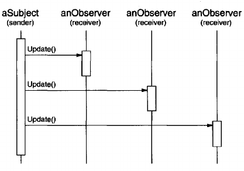
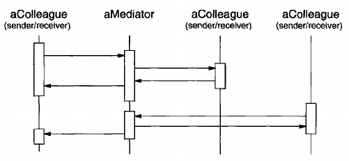
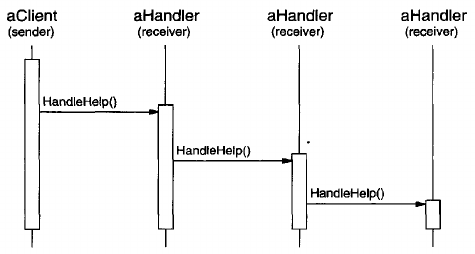

# Discussion of Behavioral Patterns

## Encapsulating Variation
Encapsulating variation is a theme of many behavioral patterns. When an aspect of a program changes frequently, these patterns define an object that encapsulates that aspect. Then other parts of the program can collaborate with the object whenever they depend on that aspect. The patterns usually define an abstract class that describes the encapsulating object, and the pattern derives its name from that object. For example,
- a Strategy object encapsulates an algorithm,
- a State object encapsulates a state-dependent behavior,
- a Mediator object encapsulates the protocol between objects, and
- an Iterator object encapsulates the way you access and traverse the components of an aggregate object.

These patterns describe aspects of a program that are likely to change. Most patterns have two kings of objects: the new object(s) that encapsulate the aspect, and the existing object(s) that use the new ones. Usually the functionality of new objects would be an integral part of the existing objects were it not for the pattern. For example, code for a Strategy would probably be wired into the strategy's Context, and code for a State would be implemented directly in the state's Context.

But not all object behavioral patterns partition functionality like this. For example, Chain of Responsibility deals with an arbitrary number of objects (i.e., a chain), all of which may already exist in the system.

Chain of Responsibility illustrates another difference in behavioral patterns: Not all define static communication relationships between classes. Chain of Responsibility prescribes communication between an open-ended number of objects. Other patterns involve objects that are passed around as arguments.

## Objects as Arguments
Several patterns introduce an object that's *always* used as an argument. One of these is Visitor. A Visitor object is the argument to a polymorphic  Accept operation on the objects it visits. The visitor is never considered a part of those objects, even though the conventional alternative to the pattern is to distribute Visitor code across the object structure classes.

Other patterns define objects that act as magic tokens to be passed around and invoked at a later time. Both Command and Memento fall into this category. In Command, the token represents a request; in Memento, it represents the internal state of an object at a particular time. In both cases, the token can have a complex internal representation, but the client is never aware of it. But even here there are differences. Polymorphism is important in the COmmand pattern, because executing the Command object is a polymorphic operation. In contrast, the Memento interface is so narrow that a memento can only be passed as a value. So it's likely to present no polymorphic operations at all to its clients.

## Should Communication be Encapsulated or Distributed?
Mediator and Observer are competing patterns. The difference between them is that Observer distributes communication by introducing Observer and Subject objects, whereas a Mediator object encapsulates the communication between other objects.

In the Observer pattern, there is no single object that encapsulates a constraint. Instead, the Observer and the Subject must cooperate to maintain the constraint. Communication patterns are determined by the way observers and subjects are interconnected: a single subject usually has many observers, and sometimes the observer of one subject is a subject of another observer. The Mediator pattern centralizes rather than distributes. It places the responsibility for maintaining a constraint squarely in the mediator.

We've found it easier to make reusable Observers and Subjects than  to make reusable Mediators. The Observer pattern promotes partitioning and loose coupling between Observer and Subject, and that leads to finer-grained classes that are more apt to be reused.

On the other hand, it's easier to understand the flow of communication in Mediator than in Observer. Observers and subjects are usually connected shortly after they're created, and it's hard to see how they are connected later in the program. If you know the Observer pattern, then you understand that the way observers and subjects are connected is important, and you also know what connections to look for. However, the indirection that Observer introduces will still make a system harder to understand.

Observers in Smalltalk can be parameterized with messages to access the Subject state, and so they are even more reusable than they are in C++. This makes Observer more attractive than Mediator in Smalltalk. Thus a Smalltalk programmer will often use Observer where a C++ programmer would use Mediator.

## Decoupling Senders and Receivers
When collaborating objects refer to each other directly, they become dependent on each other, and that can have an adverse impact on the layering and reusability of a system. Command, Observer, Mediator, and Chain of Responsibility address how you can decouple senders and receivers, but with different trade-offs.

The Command pattern supports decoupling by using a Command object to define the binding between a sender and receiver:

The Command object provides a simple interface for issuing the request (that is, the Execute operation). Defining the sender-receiver connection in a separate object lets the sender work with different receivers. It keeps the sender decoupled from the receivers, making senders easy to reuse. Moreover, you can reuse the Command object to parameterize a receiver with different senders. The Command pattern nominally requires a subclass for each sender-receiver connection, although the pattern describes implementation techniques that avoid subclassing.

The Observer pattern decouples senders (subjects) from receivers (observers) by defining an interface for signaling changes in subjects. Observer defines a looser sender-receiver binding than Command, since a subject may have multiple observers, and their number can vary at run-time.

The Subject and Observer interfaces in the Observer pattern are designed for communicating changes. Therefore the Observer pattern is best for coupling objects when there are data dependencies between them.

The Mediator pattern decouples objects by having them refer to each other indirectly through a Mediator object.

A Mediator object routes requests between Colleague objects and centralizes their communication. Consequently, colleagues can only talk to each other through the Mediator interface. Because this interface is fixed, the Mediator might have to implement its own dispatching scheme for added flexibility. Requests can be encoded and arguments packed in such a way that colleagues can request an open-ended set of operations.

The Mediator pattern can reduce subclassing in a system, because it centralizes communication behavior in one class instead of distributing it among subclasses. However, *ad hoc* dispatching schemes often decrease type safety.

Finally, the Chain of Responsibility pattern decouples the sender from the receiver by passing the request along a chain of potential receivers:

Since the interface between senders and receivers is fixed, Chain of Responsibility may also require a custom dispatching scheme. Hence it has the same type-safety drawbacks as Mediator. Chain of Responsibility is a good way to decouple the sender and the receiver if the chain is already part of the system's structure, and one of several objects may be in a position to handle the request. Moreover, the pattern offers added flexibility in that the chain can be changed or extended easily.

## Summary
With few exceptions, behavioral design patterns complement and reinforce each other. A class in a chain of responsibility, for example, will probably include at least one application of Template Method. The template method can use primitive operations to determine whether the object should handle the request and to choose the object to forward to. The chain can use the Command pattern to represent requests as objects. Interpreter can use the State pattern to define parsing contexts. An iterator can traverse an aggregate, and a visitor can apply an operation to each element in the aggregate.

Behavioral patterns work well with other patterns, too. For example, a system that uses the Composite pattern might use a visitor to perform operations on components of the composition. It could use Chain of Responsibility to let components access global properties through their parent. It could also use Decorator to override these properties on parts of the composition. It could use the Observer pattern to tie one object structure to another and the State pattern to let a component change its behavior as its state changes. The composition itself might be created using the approach in Builder, and it might be treated as a Prototype by some other part of the system.

Well-designed object-oriented systems are just like this - they have multiple patterns embedded in them - but not because their designers necessarily thought in these terms. Composition at the *pattern* level rather than the class or object levels lets us achieve the same synergy with greater ease.